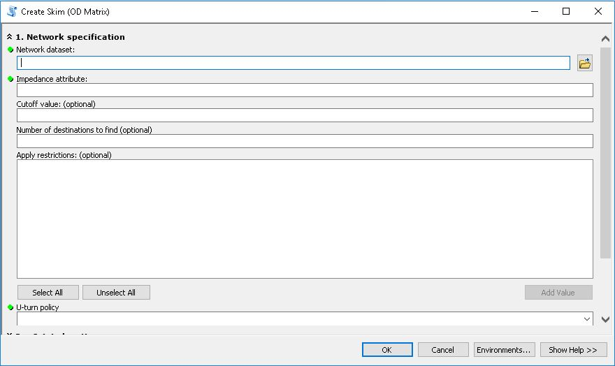
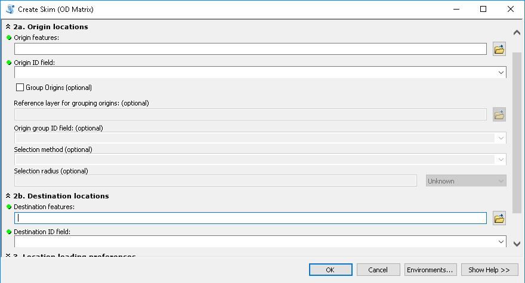
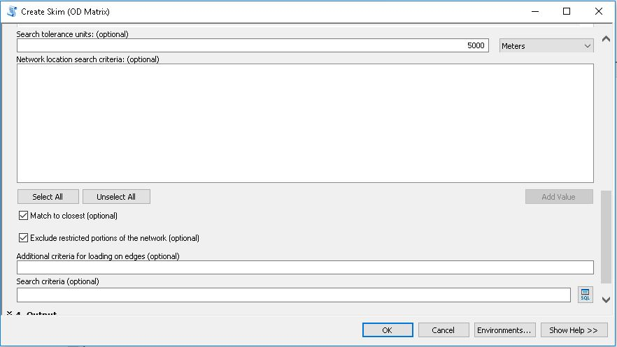
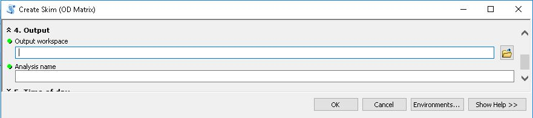
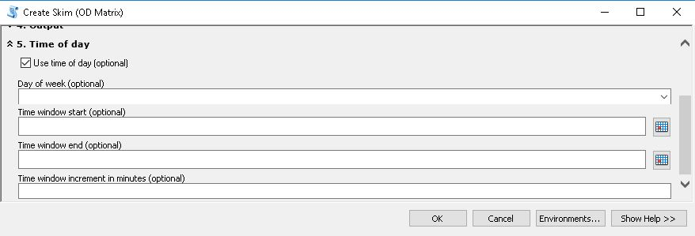
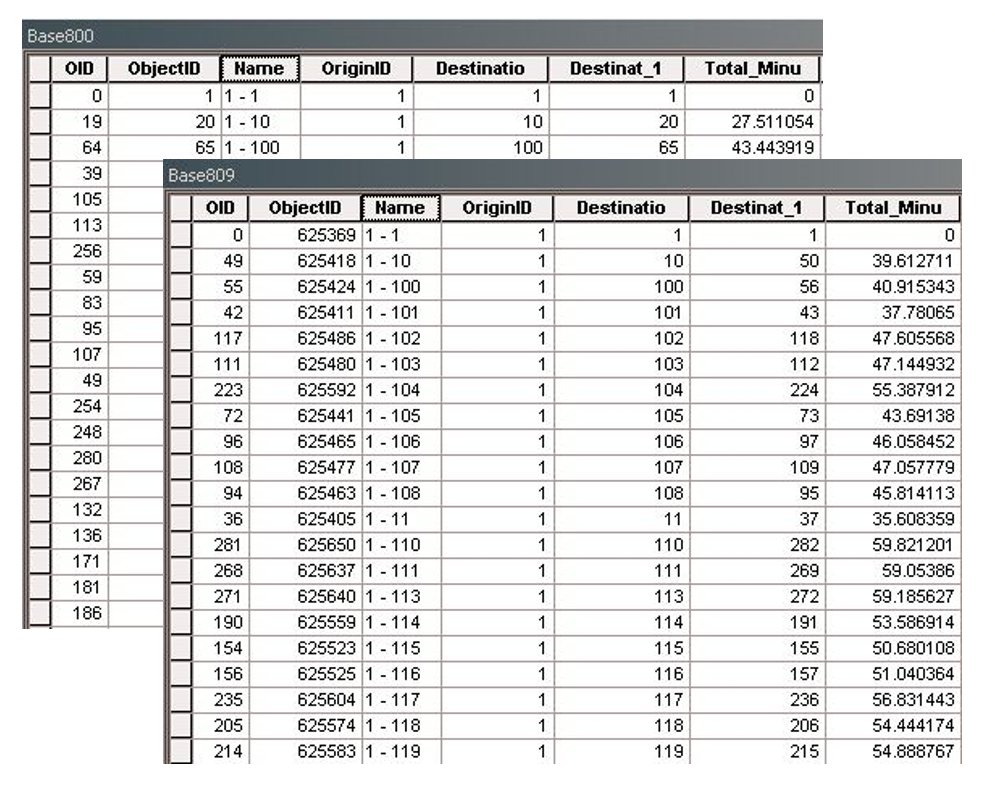
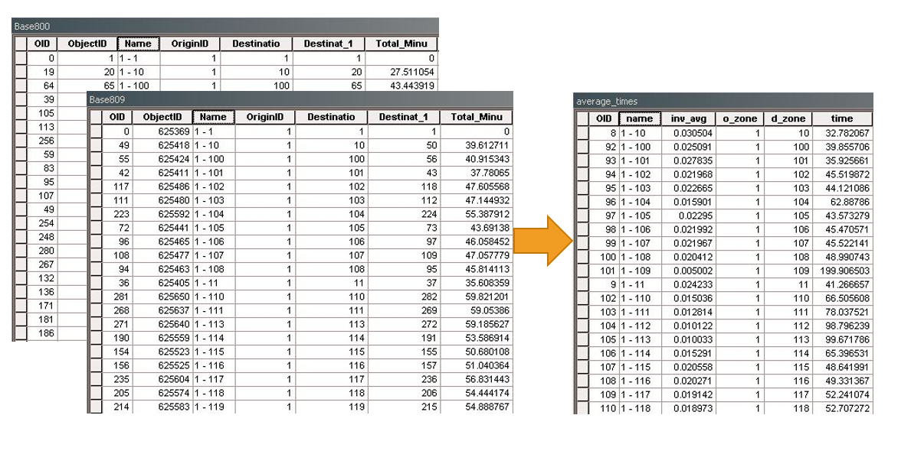
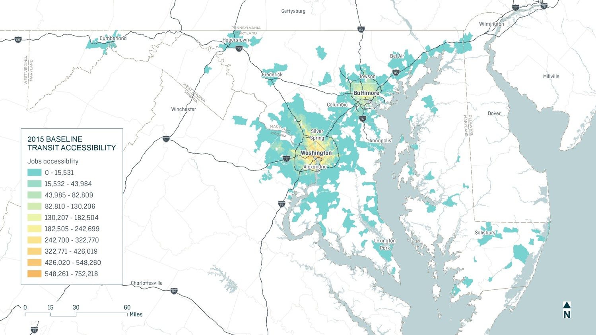
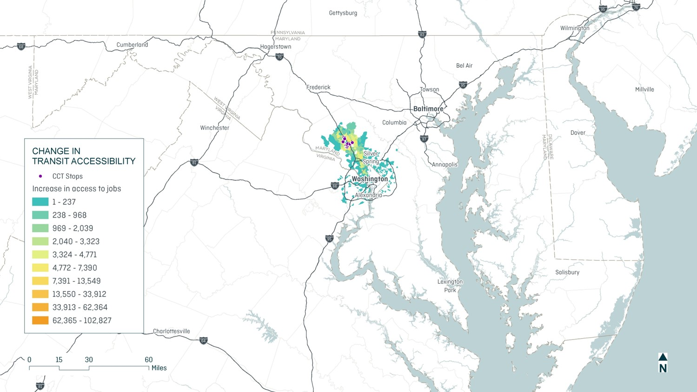

======================
MMA Processing Steps
======================

Following the preparation of socio-economic and network data as described in previous 
sections of this guide, accessibility scores can be calculated, summarized, and compared 
to a base condition to identify changes in access to jobs. The following workflow describes 
the overall approach to this analysis using the MMA and Chapter 30 toolboxes.

1. Define Decay Curves 
~~~~~~~~~~~~~~~~~~~~~~~~~~~~~~~~~~~

`Decay rates <key-terms.html#decay-rates>`_ define how travel impedance alters the value of a 
given activity. In general, activities that are far away are less attractive than activities 
that are nearby. The `Manage Decay Rates <gp-decay-rates.html>`_ tool located in the MMA toolbox 
is used for creating and modifying these values. 

2. Create Skims (CS)
~~~~~~~~~~~~~~~~~~~~~~~~~~~~~~~~~~~~~~~~~~~~~~~~~~~~~~~~~~~~~~~~~~~~~~~~~~~~~~~~~~~~

Use the `Create Skims <gp-create-skim.html>`_ tool in the MMA toolbox to create a transit skim.  This tool interface 
consists of five sections, which are described in detail below.

**CS.1. Network specification**

This section of the tool provides details of the network dataset supporting the analysis.

+-------------------------------------------+---------------------------------------------------------------------------------------------------------------------------------------------------------------------------------------------------------------------------------------------------------------------+-------------------+
| Field                                     | Description                                                                                                                                                                                                                                                         | Recommended Value |
+===========================================+=====================================================================================================================================================================================================================================================================+===================+
| Network dataset                           | The built transit network dataset                                                                                                                                                                                                                                   |                   |
+-------------------------------------------+---------------------------------------------------------------------------------------------------------------------------------------------------------------------------------------------------------------------------------------------------------------------+-------------------+
| Impedance attribute                       | Travel time impedance attribute in the network dataset                                                                                                                                                                                                              | TransitMin        |
+-------------------------------------------+---------------------------------------------------------------------------------------------------------------------------------------------------------------------------------------------------------------------------------------------------------------------+-------------------+
| Cutoff value (optional)                   | Cutoff value: 60 minutes                                                                                                                                                                                                                                            | 60                |
+-------------------------------------------+---------------------------------------------------------------------------------------------------------------------------------------------------------------------------------------------------------------------------------------------------------------------+-------------------+
| Number of destinations to find (optional) | Leaving this blank will find all destinations within the cutoff                                                                                                                                                                                                     |                   |
+-------------------------------------------+---------------------------------------------------------------------------------------------------------------------------------------------------------------------------------------------------------------------------------------------------------------------+-------------------+
| Apply restrictions (optional)             | This network was constructed such that no restriction attributes were required, so this list appears blank. If restrictions have been set up, choose the appropriate restrictions to apply when running the analysis (do not walk on limited access highways, e.g.) |                   |
+-------------------------------------------+---------------------------------------------------------------------------------------------------------------------------------------------------------------------------------------------------------------------------------------------------------------------+-------------------+
| U-turn policy                             | In most applications for walking or transit, there is no reason to adopt a strict U-turn policy, so “ALLOW_UTURNS” is generally recommended                                                                                                                         |  Allow U turns    |
+-------------------------------------------+---------------------------------------------------------------------------------------------------------------------------------------------------------------------------------------------------------------------------------------------------------------------+-------------------+

**CS.2. OD locations**

This section specifies the features that will represent origin and destination locations and 
how to group these features (if desired or needed for memory management). 
	

+----------------------+---------------------------------------------------------------------------------------------------------------------------------+-------------------+
| Field                | Description                                                                                                                     | Recommended Value |
+======================+=================================================================================================================================+===================+
| Origin features      | Origins for statewide transit analysis are represented by Level 2 zonal centroids from the MSTM.                                | \L2_Centroids.shp |
+----------------------+---------------------------------------------------------------------------------------------------------------------------------+-------------------+
| Origin ID field      | A field identifying each zone will be available in the centroids feature class to use as the “ID field” for each location type. | N                 |
+----------------------+---------------------------------------------------------------------------------------------------------------------------------+-------------------+
| Destination features | Origins for statewide transit analysis are represented by Level 2 zonal centroids from the MSTM.                                | \L2_Centroids.shp |
+----------------------+---------------------------------------------------------------------------------------------------------------------------------+-------------------+
| Destination ID field | A field identifying each zone will be available in the centroids feature class to use as the “ID field” for each location type. | N                 |
+----------------------+---------------------------------------------------------------------------------------------------------------------------------+-------------------+
	
**CS.3. Location loading preferences**

This section defines how OD features will load onto the network using pre-calculated network 
location fields or spatial analysis.

+-------------------------------------------------------+------------------------------------------------------------------------------------------------------------------+-----------------------+
| Field                                                 | Description                                                                                                      | Recommended Value     |
+=======================================================+==================================================================================================================+=======================+
| Search tolerance (optional)                           | Search for loadable features within this tolerance (most locations will                                          | 5000 Meters           |
|                                                       | still load on features much nearer than the tolerance if it is set generously)                                   |                       |
+-------------------------------------------------------+------------------------------------------------------------------------------------------------------------------+-----------------------+
| Network location search criteria (optional)           | Origins and destinations (zone centroids) should only be able to load                                            | Only check L3_Hwy End |
|                                                       | onto pedestrian links – not directly at bus stops or on transit lines.                                           |                       |
+-------------------------------------------------------+------------------------------------------------------------------------------------------------------------------+-----------------------+
| Match to closest (optional)                           | Match to closest should be checked in almost all applications                                                    | Check                 |
+-------------------------------------------------------+------------------------------------------------------------------------------------------------------------------+-----------------------+
| Exclude restricted portions of the network (optional) | Excluding restricted portions of the network is usually a good idea so that locations load on traversable links. | Check                 |
+-------------------------------------------------------+------------------------------------------------------------------------------------------------------------------+-----------------------+
| Additional criteria fr loading on edges (optional)    | Additional search criteria may be applied to links in the network.                                               | L3_HWY                |
+-------------------------------------------------------+                                                                                                                  +-----------------------+
| Search criteria (optional)                            |                                                                                                                  | SWFT=11               |
+-------------------------------------------------------+------------------------------------------------------------------------------------------------------------------+-----------------------+

**CS.4. Output**

This section specifies where the output table(s) will be stored and how to name them.

+------------------+----------------------------------------------------------------------------------------------------------------------------------------------------------------------------------------------------------------------------+----------------------------------------------------------------+
| Field            | Description                                                                                                                                                                                                                | Recommended Value                                              |
+==================+============================================================================================================================================================================================================================+================================================================+
| Output workspace | The create skims tool will produce at least one skim table and possibly multiple tables, depending on how the form has been completed. The tool needs to know where to save these outputs and a generalized analysis name. | \Skims\[Create a new folder for the base and for each project] |
+------------------+----------------------------------------------------------------------------------------------------------------------------------------------------------------------------------------------------------------------------+----------------------------------------------------------------+
| Analysis name    | The output tables will include the analysis name as well as suffixes to describe their geography or time of day attributes, as needed.                                                                                     | Tran_Prj#                                                      |
+------------------+----------------------------------------------------------------------------------------------------------------------------------------------------------------------------------------------------------------------------+----------------------------------------------------------------+

**CS.5. Time of day**

Specify the time of day for the analysis and setup iterative runs covering multiple times 
throughout the day. Chapter 30 parameters for these variables are indicated in the screenshot below.

+---------------------------------------------+-------------------------------------------------------------------------------------------------------------------------------------------------------------------------------------------------------------------------------------------------------+-------------------+
| Field                                       | Description                                                                                                                                                                                                                                           | Recommended Value |
+=============================================+=======================================================================================================================================================================================================================================================+===================+
| Use time of day (optional)                  | The create skims tool will produce at least one skim table and possibly multiple tables, depending on how the form has been completed. The tool needs to know where to save these outputs and a generalized analysis name.                            | Checked           |
+---------------------------------------------+-------------------------------------------------------------------------------------------------------------------------------------------------------------------------------------------------------------------------------------------------------+-------------------+
| Day of week (optional)                      | To generalize analysis to a typical day of the week, select a value from the “Day of Week” menu. If using a generalized day of the week, select “Time Only” in the “Time window start” dialog, and specify the initial departure time to analyze.     | Wednesday         |
+---------------------------------------------+-------------------------------------------------------------------------------------------------------------------------------------------------------------------------------------------------------------------------------------------------------+-------------------+
| Time window start (optional)                | If analyzing a specific day, select “Date and Time” in the “Time window start” dialog, and specify the date on the calendar as well as the initial departure time to analyze (the “day of week” field will be ignored if a specific date is selected) | 7:00 AM           |
+---------------------------------------------+-------------------------------------------------------------------------------------------------------------------------------------------------------------------------------------------------------------------------------------------------------+-------------------+
| Time window end (optional)                  | If analyzing multiple departure times, specify the closing time for the window as “Time only” in the “Time window end” dialog                                                                                                                         | 8:30 AM           |
+---------------------------------------------+-------------------------------------------------------------------------------------------------------------------------------------------------------------------------------------------------------------------------------------------------------+-------------------+
| Time window increment in minutes (optional) | If analyzing multiple departure times, specify the interval of minutes.                                                                                                                                                                               | 9                 |
+---------------------------------------------+-------------------------------------------------------------------------------------------------------------------------------------------------------------------------------------------------------------------------------------------------------+-------------------+

**CS.Output Resulting Skim File(s)**

The Create Skims tool produces multiple tables with estimated travel times between zones for each specified 
departure time. Travel times and accessibility vary by time of day.

	
.. todo:: File naming convention reflects analysis name, origin group ID values, and time of day as a date/time string.

3. Produce average travel times skim
~~~~~~~~~~~~~~~~~~~~~~~~~~~~~~~~~~~~~~~~~~~~~~~~~~~~~~~~~~~~~~~~~~~~~~~~~~~~~~~~~~~~

Separate transit skims are created for specific departure times as specified in the "CS.5. Time of Day" above. 
All of the resulting skims will be stored in a single folder for calculating average transit travel times 
during the travel period specified by the Time Window settings. Run the `Average travel times <gp-average-matrix.html>`_ 
tool to  summarize the multiple skims created during the “Create skims” step into a single skim reflecting typical 
conditions for the travel period. 

The “Name” field should be “Name” if the skims were developed using the “Create Skims” tool. The name field anticipates 
values structured as “{origin name} – {destination name}” (note the “ – “ delimiter). 

The “impedance” field stores travel time estimates between each zone pair for specific departure times, as specified in 
the Time Window settings of the "Create Skims" tool.

Reference zones and ID information are provided so that origin and destination zones can be properly indexed during the 
averaging process. These zones should reflect those used during the skim generation process.

.. figure:: ../images/CreateAverageMatrix.JPG

+-----------------------------------------------+---------------------------------------------------------------------------+-----------------------+
| Field                                         | Description                                                               | Recommended Value     |
+===============================================+===========================================================================+=======================+
| Workspace with skims tables (OD matricies)    | Separate transit skims are created for specific departure times as        |                       |
|                                               | specified in section 5 of the “Create OD Matrix” tool.  All of the        |                       |
|                                               | resulting skims should be stored in a single folder for calculating       |                       |
|                                               | average transit travel times during the travel period.  The folder        |                       |
|                                               | with the time-of-day results is provided here, and the specific tables    |                       |
|                                               | to summarize are selected from the list below.                            |                       |
+-----------------------------------------------+---------------------------------------------------------------------------+-----------------------+
| Skim tables (OD matrices) to average          | Attributes of the time-of-day skims are listed to ensure the correct      |                       |
|                                               | columns are referenced when developing the period-wide average skim.      |                       |
|                                               | The “Name” field should be “Name” if the skims were developed using the   |                       |
+-----------------------------------------------+ “Create OD Matrix” tool.  The name field anticipates values structured    +                       +
| Skim tables (OD matrices) "Name" field        | as “[origin name] – [destination name]”                                   |                       |
|                                               |                                                                           |                       |
|                                               |                                                                           |                       |
+-----------------------------------------------+---------------------------------------------------------------------------+-----------------------+
| Skim table (OD matrix) impedance weight field | The “impedance weight” field is the field storing time-of-day travel      |                       |
|                                               | time estimates between each zone pair.                                    |                       |
+-----------------------------------------------+---------------------------------------------------------------------------+-----------------------+
| Reference zones                               | Reference zones and ID information are provided so that origin and        |                       |
+-----------------------------------------------+ destination zones can be properly indexed during the averaging process.   +                       +
| Zone ID field                                 | These zones should reflect those used during the skim generation process. |                       |
+-----------------------------------------------+---------------------------------------------------------------------------+-----------------------+
| Output table                                  | Location to create database.                                              |                       |
+-----------------------------------------------+---------------------------------------------------------------------------+-----------------------+

.. todo:: Explain QA steps taken after creating the average skim.

4. Summarize accessibility
~~~~~~~~~~~~~~~~~~~~~~~~~~~~~~~~~~~~~~~~~~~~

This is the final step in developing MMA scores for each scenario.  Use the `Summarize Accessibility <gp-summarize-accessibility.html>`_ 
tool in the MMA toolbox to process skims and zonal data to produce accessibility scores by zone.

.. figure:: ../images/SummarizeAccessibility.JPG 

.. table:: Summarize Accessibility
   :widths: auto
   :width: 80%
   
+--------------------------------+-------------------------------------------------------------------------------------------------------------------------------------------------------------------------------------------------------------------------------------------------------------------------------------------------------------------------------------------------------------------------------+-------------------+
| Field                          | Description                                                                                                                                                                                                                                                                                                                                                                   | Recommended Value |
+================================+===============================================================================================================================================================================================================================================================================================================================================================================+===================+
| Skim reference files           | Skim reference files (JSON format) store metadata about skim tables. These files are parsed by the “Summarize Accessibility” tool and define which fields to use for identifying origin/destination zones and travel time information. The tool can handle multiple skim reference files.                                                                                     |                   |
|                                |                                                                                                                                                                                                                                                                                                                                                                               |                   |
|                                | Multiple files should be used when:                                                                                                                                                                                                                                                                                                                                           |                   |
|                                |                                                                                                                                                                                                                                                                                                                                                                               |                   |
|                                | - Analyzing multiple modes at the same geographic scale (run in series) A single study area requires multiple skim tables due to its size (i.e., if origins were “grouped” in the “Create OD Matrix (skim)” tool) (do not run in series)                                                                                                                                      |                   |
|                                |                                                                                                                                                                                                                                                                                                                                                                               |                   |
|                                | - Accessibility is being summarized for multiple departure times (run in series)                                                                                                                                                                                                                                                                                              |                   |
+--------------------------------+-------------------------------------------------------------------------------------------------------------------------------------------------------------------------------------------------------------------------------------------------------------------------------------------------------------------------------------------------------------------------------+-------------------+
| Run in series (optional)       | When the Summarize Accessibility tool is “run in series,” a distinct output table will be created for each skim reference file provided in the list at top. Otherwise, all results will be “collapsed” into a single table.                                                                                                                                                   | Not checked       |
+--------------------------------+-------------------------------------------------------------------------------------------------------------------------------------------------------------------------------------------------------------------------------------------------------------------------------------------------------------------------------------------------------------------------------+-------------------+
| Land use table                 | Accessibility is summarized based on land use data that define the number of activities in each zone. For each origin zone, the number of activities at reachable destinations is summarized. The table of land uses providing these zonal data must be specified here.                                                                                                       |                   |
+--------------------------------+-------------------------------------------------------------------------------------------------------------------------------------------------------------------------------------------------------------------------------------------------------------------------------------------------------------------------------------------------------------------------------+-------------------+
| Land use table ID field        | In the skims files, the origin and destination zones are stored using zone ID values. The corresponding ID values for the land use table are specified here. The data type for the land use table ID field should match the data type for OD data stored in the skims tables (if OD values are stored as text, the land use table ID field should be a text field also, e.g.) |                   |
+--------------------------------+-------------------------------------------------------------------------------------------------------------------------------------------------------------------------------------------------------------------------------------------------------------------------------------------------------------------------------------------------------------------------------+-------------------+
| Land use table activity fields | Activities to summarize are listed here. Multiple fields may be selected. In the example, access to “education” and “health care” jobs will be summarized (as well as all jobs, which is not pictured due to the length of the fields list)                                                                                                                                   |                   |
+--------------------------------+-------------------------------------------------------------------------------------------------------------------------------------------------------------------------------------------------------------------------------------------------------------------------------------------------------------------------------------------------------------------------------+-------------------+
| Apply decay rates              | Decay rates define the value of time, weighting destinations nearby as being more valuable than destinations farther away. They can also be used to create “time slices” of accessibility. Decay rates are managed using the `"Manage Decay Rates </en/latest/q/gp-decay-rates.html>`_ tool.                                                                                  |                   |
|                                |                                                                                                                                                                                                                                                                                                                                                                               |                   |
|                                | Provide desired decay rate files (JSON format) here to utilize decay weighting in the accessibility analysis. The tool will always produce “un-decayed” summaries of activities accessible and will produce “decayed” results with column headings corresponding to the decay rate names associated with each decay rate configuration (JSON) file.                           |                   |
+--------------------------------+-------------------------------------------------------------------------------------------------------------------------------------------------------------------------------------------------------------------------------------------------------------------------------------------------------------------------------------------------------------------------------+-------------------+

**Summarize Accessibility Results**

The tool yields one or more tables of accessibility results that can be joined to a zone feature class for mapping.

5. Calculate change in accessibility
~~~~~~~~~~~~~~~~~~~~~~~~~~~~~~~~~~~~~~~~~~~~~~~~~~~~~~~~~~~~~~~~~~~~~~~~~~~~~~~~~~~~

Use the `Calculate Change in Accessibility <gp-change-in-accessibility.html>`_ tool to understand how 
accessibility is modified by a project altering the transportation system and/or land uses. 
Provide a "no build" table reflecting baseline accessibility scores and a 
build table reflecting new accessibility scores assuming the project is implemented.

.. figure:: ../images/CalculateChangeInAccessibility.JPG

+----------------------+---------------------------------------------------------------------------------------------------------------------------------------------------------------------------------------------------------------------------------------------------------------------------------------------------------------------------------------------------------------------------------------------------------+-------------------+
| Field                | Description                                                                                                                                                                                                                                                                                                                                                                                             | Recommended Value |
+======================+=========================================================================================================================================================================================================================================================================================================================================================================================================+===================+
| No build table       | The “no build” table is the table containing the baseline accessibility scores.                                                                                                                                                                                                                                                                                                                         |                   |
+----------------------+---------------------------------------------------------------------------------------------------------------------------------------------------------------------------------------------------------------------------------------------------------------------------------------------------------------------------------------------------------------------------------------------------------+-------------------+
| Build table          | The “build” table is the table containing the project accessibility scores. The tool assumes each table has the same structure (column names and data types).                                                                                                                                                                                                                                           |                   |
+----------------------+---------------------------------------------------------------------------------------------------------------------------------------------------------------------------------------------------------------------------------------------------------------------------------------------------------------------------------------------------------------------------------------------------------+-------------------+
| ID field             | The “ID field” is the zone ID for zones in both tables.                                                                                                                                                                                                                                                                                                                                                 |                   |
+----------------------+---------------------------------------------------------------------------------------------------------------------------------------------------------------------------------------------------------------------------------------------------------------------------------------------------------------------------------------------------------------------------------------------------------+-------------------+
| Accessibility fields | The “Accessibility fields” are the accessibility scores for which the tool will produce the “change” values for. In the example, “HBWA_TOTAL_40” in the no build table will be subtracted from “HBWA_TOTAL_40” in the build table to produce a field called “HBWA_TOTAL_40” in the output table representing the change in accessibility for that activity (gravity-weighted jobs in 2040 in this case) |                   |
+----------------------+---------------------------------------------------------------------------------------------------------------------------------------------------------------------------------------------------------------------------------------------------------------------------------------------------------------------------------------------------------------------------------------------------------+-------------------+
| Output table         | The “output table” is the table that will be produced by the tool defining changes in accessibility for the selected “accessibility fields.”                                                                                                                                                                                                                                                            |                   |
+----------------------+---------------------------------------------------------------------------------------------------------------------------------------------------------------------------------------------------------------------------------------------------------------------------------------------------------------------------------------------------------------------------------------------------------+-------------------+

**Change in accessibility result**

