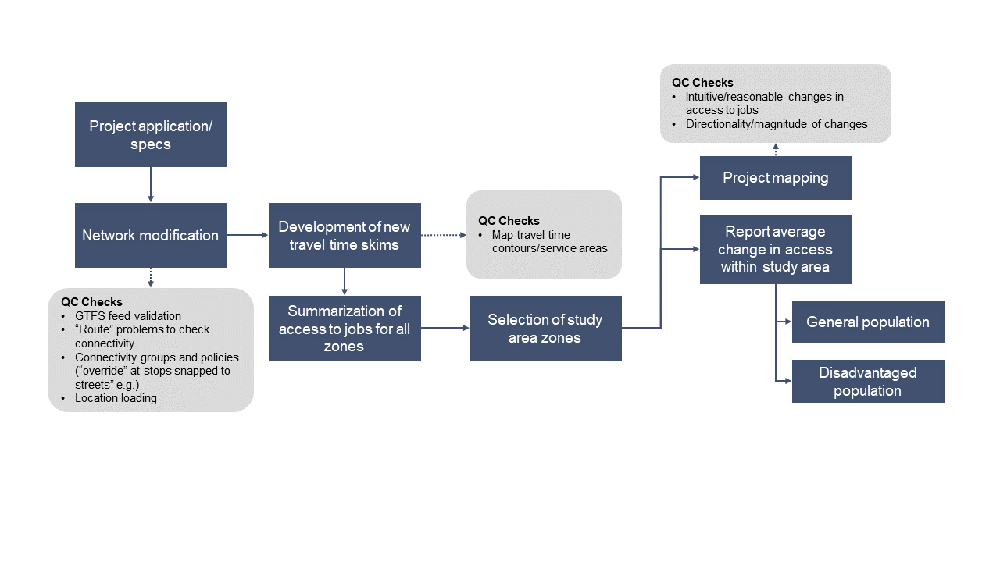

Chapter 30 Transit Scoring Workflow Overview 
==============================================

The Chapter 30 project scoring process follows this general workflow:

1. Prepare data
2. Network setup
3. Run accessibility tools
4. Quality assurance
5. Prepare Chapter 30 Transit Project Report

.. toctree::
    :maxdepth: 3

    Data Preparation <data-prep>
    Network Setup <network-setup>
	MMA Processing <Ch30-mma-steps>
    Score Development <score-dev>