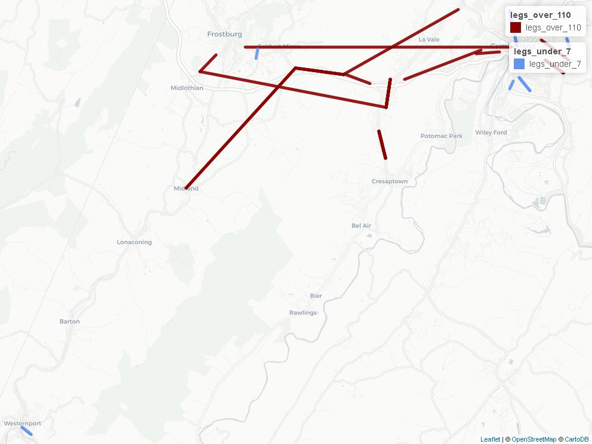
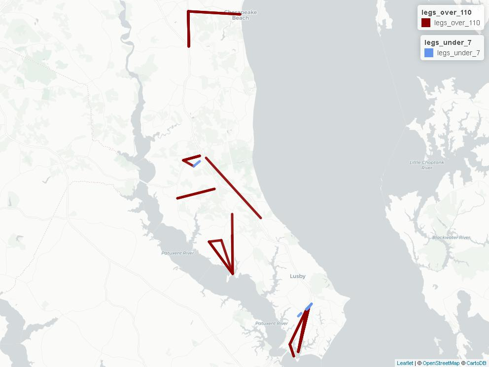
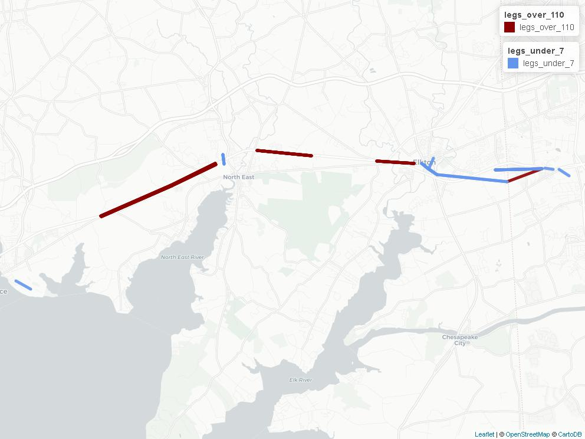
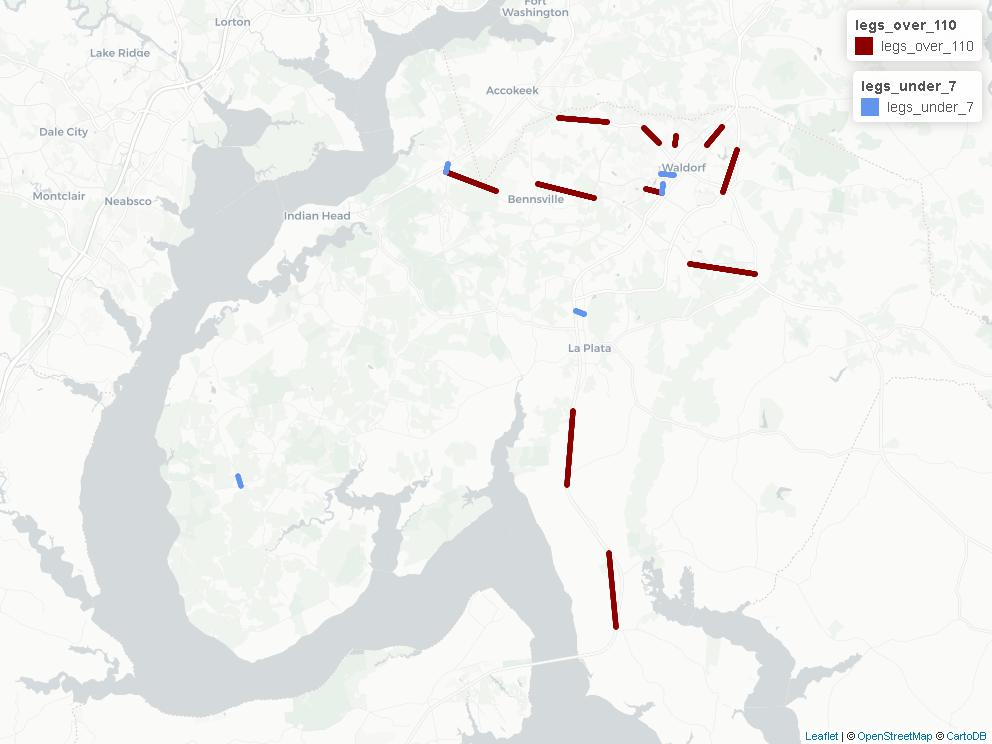
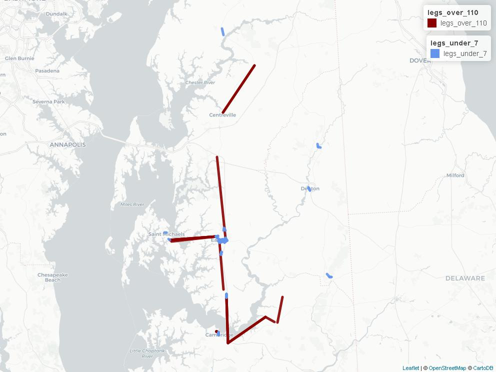
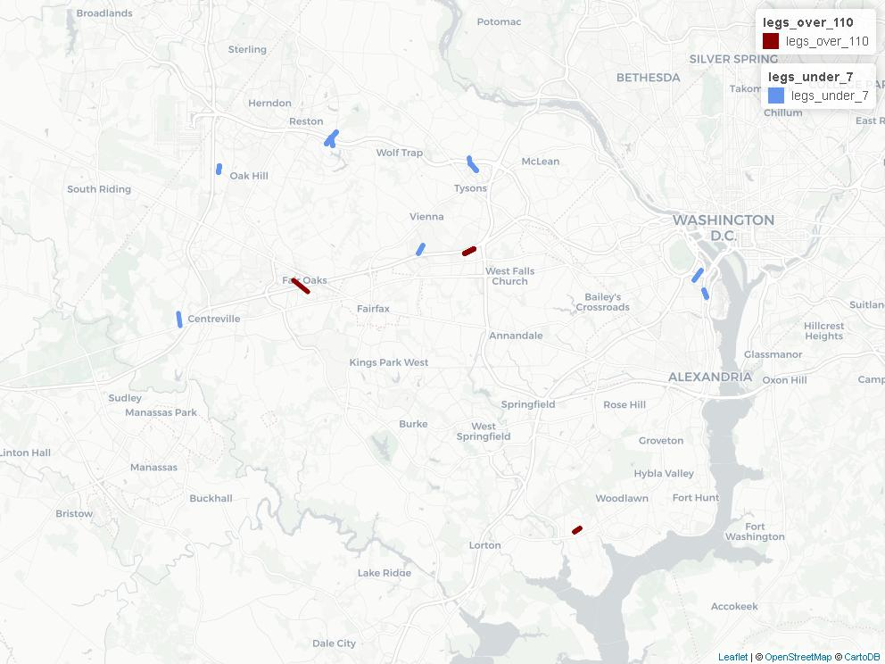
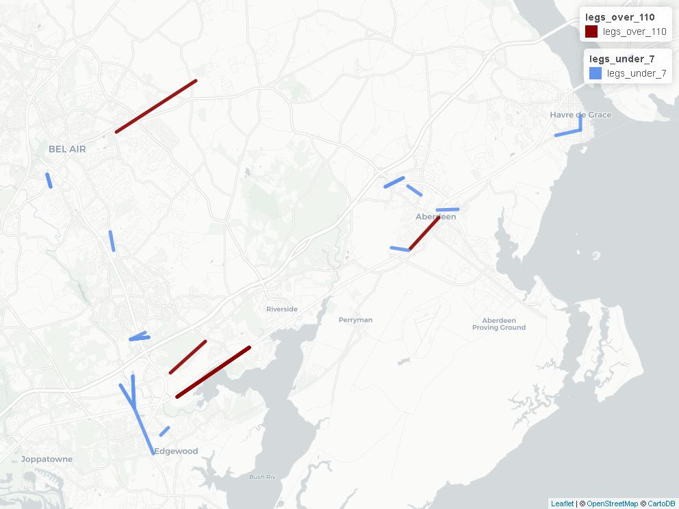
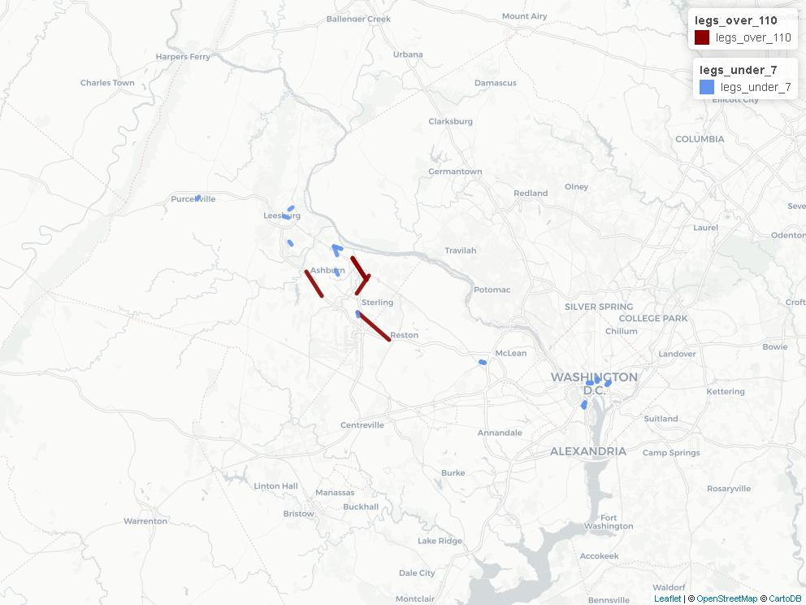
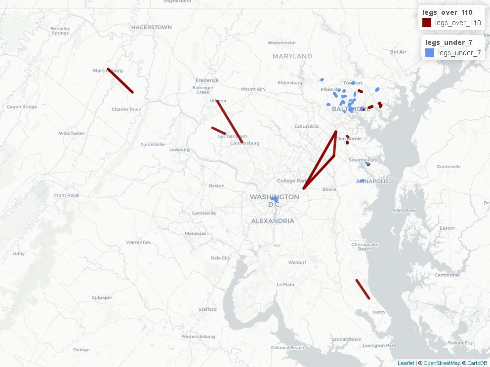
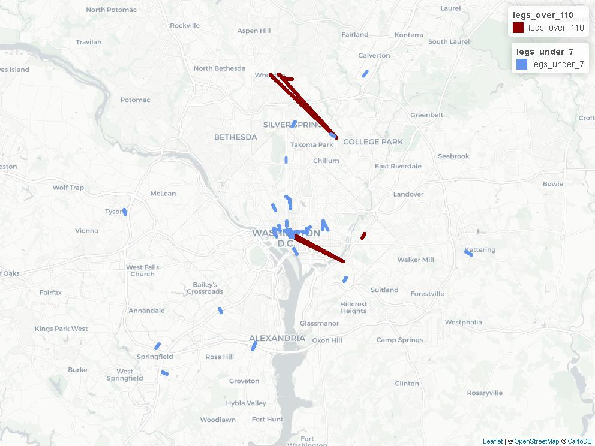

=================================================================
Chapter 30 Base Transit Network GTFS Feed Speed Validation Results
==================================================================

The findings of the GTFS validation procedures identifying very fast or very slow travel speeds
between transit stops are provided on this page.  Results are listed by agency name.

Validation Outputs
~~~~~~~~~~~~~~~~~~~~

The following maps and tables are the outputs produced by the speed validator tool. This tool was run to validate base transit network GTFS feeds
in cases where the FeedValidator utility indicated further validation steps were necessary.

Allegany Transit
-----------------

	
+----------------------------------------------+-------------------------------------------------------+----------+-----------------------------------+----------+--------------------+-----------------+
| from_stop_name                               | to_stop_name                                          | route_id | route_long_name                   | max_kmph | max_distance_miles | number_of_trips |
+----------------------------------------------+-------------------------------------------------------+----------+-----------------------------------+----------+--------------------+-----------------+
| Main St & Sleeman St                         | Frederick St & Mechanic St                            | Gold     | Country Club Mall / Frostburg     | 281.3    | 8.16               | 1               |
+----------------------------------------------+-------------------------------------------------------+----------+-----------------------------------+----------+--------------------+-----------------+
| Walmart Grocery Entrance                     | Active Network, Inc                                   | Silver   | Morning Service                   | 168.31   | 5.81               | 1               |
+----------------------------------------------+-------------------------------------------------------+----------+-----------------------------------+----------+--------------------+-----------------+
| Red Hill Plaza (Cumberland Treatment Center) | LaVale Sheetz                                         | Green 1  | LaVale / Cresaptown / Bedford Rd  | 164.35   | 0.85               | 1               |
+----------------------------------------------+-------------------------------------------------------+----------+-----------------------------------+----------+--------------------+-----------------+
| Golden Living Center                         | Urology Associates                                    | Red 1    | Willowbrook Rd / South Cumberland | 162.16   | 0.67               | 8               |
+----------------------------------------------+-------------------------------------------------------+----------+-----------------------------------+----------+--------------------+-----------------+
| Midland MD 36 & Big Lane Ave                 | Clarysville Motel                                     | Purple   | Westernport / LaVale / Bedford Rd | 153.77   | 4.96               | 2               |
+----------------------------------------------+-------------------------------------------------------+----------+-----------------------------------+----------+--------------------+-----------------+
| Opposite Lions Ball Field                    | Pyzano's                                              | Yellow   | Evening Service                   | 145.41   | 2.51               | 1               |
+----------------------------------------------+-------------------------------------------------------+----------+-----------------------------------+----------+--------------------+-----------------+
| Greene St & Lee St                           | Gold Dingle                                           | Yellow   | Evening Service                   | 139.16   | 0.72               | 1               |
+----------------------------------------------+-------------------------------------------------------+----------+-----------------------------------+----------+--------------------+-----------------+
| MVA                                          | Tradewinds                                            | Green 1  | LaVale / Cresaptown / Bedford Rd  | 132.12   | 0.84               | 5               |
+----------------------------------------------+-------------------------------------------------------+----------+-----------------------------------+----------+--------------------+-----------------+
| Red Hill Plaza (Cumberland Treatment Center) | Valley Plaza                                          | Gold     | Country Club Mall / Frostburg     | 129.29   | 4.02               | 1               |
+----------------------------------------------+-------------------------------------------------------+----------+-----------------------------------+----------+--------------------+-----------------+
| Willowbrook Rd & Pine Ave                    | Brook Building                                        | Yellow   | Evening Service                   | 126.09   | 1.04               | 1               |
+----------------------------------------------+-------------------------------------------------------+----------+-----------------------------------+----------+--------------------+-----------------+
| Walmart Grocery Entrance                     | Lowe's & Burton's Plaza                               | FSU 3    | FSU Saturday Shuttle              | 125.18   | 0.86               | 7               |
+----------------------------------------------+-------------------------------------------------------+----------+-----------------------------------+----------+--------------------+-----------------+
| MVA                                          | Tradewinds                                            | Purple   | Westernport / LaVale / Bedford Rd | 122.21   | 0.84               | 1               |
+----------------------------------------------+-------------------------------------------------------+----------+-----------------------------------+----------+--------------------+-----------------+
| MVA                                          | Tradewinds                                            | Silver   | Morning Service                   | 122.21   | 0.84               | 1               |
+----------------------------------------------+-------------------------------------------------------+----------+-----------------------------------+----------+--------------------+-----------------+
| Active Network, Inc                          | Cordts PE Center Shelter                              | Yellow   | Evening Service                   | 116.53   | 0.72               | 1               |
+----------------------------------------------+-------------------------------------------------------+----------+-----------------------------------+----------+--------------------+-----------------+
| Clarysville Motel                            | Opposite Red Hill Plaza (Cumberland Treatment Center) | Gold     | Country Club Mall / Frostburg     | 113.74   | 1.51               | 3               |
+----------------------------------------------+-------------------------------------------------------+----------+-----------------------------------+----------+--------------------+-----------------+
| Westernport Bus Stop                         | Westernport McDonalds                                 | Purple   | Westernport / LaVale / Bedford Rd | 6.61     | 0.34               | 2               |
+----------------------------------------------+-------------------------------------------------------+----------+-----------------------------------+----------+--------------------+-----------------+
| Allegany College of Maryland                 | Cumberland Meadows Apartments                         | Blue 1   | White Oaks / Willowbrook Rd       | 6.04     | 0.31               | 4               |
+----------------------------------------------+-------------------------------------------------------+----------+-----------------------------------+----------+--------------------+-----------------+
| Weis Market                                  | Frostburg Plaza (ACS)                                 | Silver   | Morning Service                   | 5.93     | 0.31               | 1               |
+----------------------------------------------+-------------------------------------------------------+----------+-----------------------------------+----------+--------------------+-----------------+
| Virginia Ave & Industrial Blvd (Rite Aid)    | Opposite HRDC                                         | Yellow   | Evening Service                   | 5.89     | 0.27               | 1               |
+----------------------------------------------+-------------------------------------------------------+----------+-----------------------------------+----------+--------------------+-----------------+
| Mountain View Apartments                     | Oldtown Rd & Race St                                  | Silver   | Morning Service                   | 4.53     | 0.52               | 2               |
+----------------------------------------------+-------------------------------------------------------+----------+-----------------------------------+----------+--------------------+-----------------+
| Allegany Nursing Home & Adult Day Care       | Rose's                                                | Silver   | Morning Service                   | 3.5      | 1.09               | 2               |
+----------------------------------------------+-------------------------------------------------------+----------+-----------------------------------+----------+--------------------+-----------------+

Calvert County Public Transit
-----------------------------

+--------------------------------------------+----------------------------------------------------+----------+----------------------------+----------+--------------------+-----------------+
| from_stop_name                             | to_stop_name                                       | route_id | route_long_name            | max_kmph | max_distance_miles | number_of_trips |
+--------------------------------------------+----------------------------------------------------+----------+----------------------------+----------+--------------------+-----------------+
| Williams Wharf Rd. and Kings Rd.           | Broomes Island Rd. and Oyster House                | 6        | Mid-County                 | 867.84   | 3                  | 2               |
+--------------------------------------------+----------------------------------------------------+----------+----------------------------+----------+--------------------+-----------------+
| Broomes Island Rd. and Oyster House        | Ross Rd.                                           | 6        | Mid-County                 | 840.32   | 2.9                | 1               |
+--------------------------------------------+----------------------------------------------------+----------+----------------------------+----------+--------------------+-----------------+
| Dowell Rd.                                 | Giant Food                                         | 7        | Lusby Shuttle              | 633.33   | 3.28               | 3               |
+--------------------------------------------+----------------------------------------------------+----------+----------------------------+----------+--------------------+-----------------+
| Broomes Island Rd. and Oyster House        | Broomes Island Rd. and Grays Rd.                   | 6        | Mid-County                 | 288.75   | 4.49               | 1               |
+--------------------------------------------+----------------------------------------------------+----------+----------------------------+----------+--------------------+-----------------+
| Broomes Island Rd. and Williams Wharf Rd.  | Williams Wharf Rd. and Kings Rd.                   | 6        | Mid-County                 | 267.88   | 0.92               | 1               |
+--------------------------------------------+----------------------------------------------------+----------+----------------------------+----------+--------------------+-----------------+
| Saint Leonard Rd. and Calvert Beach Rd.    | Courthouse                                         | 5        | South Route                | 196.74   | 6.11               | 1               |
+--------------------------------------------+----------------------------------------------------+----------+----------------------------+----------+--------------------+-----------------+
| Sixes Rd. and T Hance Turn Around          | Sixes Rd. and Adelina Rd.                          | 6        | Mid-County                 | 185.69   | 2.88               | 2               |
+--------------------------------------------+----------------------------------------------------+----------+----------------------------+----------+--------------------+-----------------+
| Patuxent Plaza Shopping Center at Bus Stop | Solomons Info Center and Island                    | 7        | Lusby Shuttle              | 183.54   | 0.95               | 3               |
+--------------------------------------------+----------------------------------------------------+----------+----------------------------+----------+--------------------+-----------------+
| Detention and Substance Abuse Center       | Yardley Hills at Community Building                | 1        | Prince Frederick Shuttle I | 179.98   | 0.93               | 1               |
+--------------------------------------------+----------------------------------------------------+----------+----------------------------+----------+--------------------+-----------------+
| Ross Rd. and Broomes Island Rd.            | Broomes Island Rd. and Oyster House                | 6        | Mid-County                 | 170.19   | 2.64               | 1               |
+--------------------------------------------+----------------------------------------------------+----------+----------------------------+----------+--------------------+-----------------+
| Dowell Rd.                                 | Southern Pines Community Center                    | 7        | Lusby Shuttle              | 135      | 3.5                | 6               |
+--------------------------------------------+----------------------------------------------------+----------+----------------------------+----------+--------------------+-----------------+
| Route 4 and Route 2                        | Route 2 and Mount Harmony Rd.                      | 4        | North Route                | 127.77   | 2.65               | 8               |
+--------------------------------------------+----------------------------------------------------+----------+----------------------------+----------+--------------------+-----------------+
| Route 2 and Mount Harmony Rd.              | Route 260 and Route 261                            | 4        | North Route                | 125.85   | 3.91               | 3               |
+--------------------------------------------+----------------------------------------------------+----------+----------------------------+----------+--------------------+-----------------+
| Walmart                                    | Detention and Substance Abuse Center               | 1        | Prince Frederick Shuttle I | 125.45   | 1.3                | 5               |
+--------------------------------------------+----------------------------------------------------+----------+----------------------------+----------+--------------------+-----------------+
| Giant Food                                 | Patuxent Plaza Shopping Center at Bus Stop         | 7        | Lusby Shuttle              | 112.59   | 2.92               | 3               |
+--------------------------------------------+----------------------------------------------------+----------+----------------------------+----------+--------------------+-----------------+
| Southern Pines Community Center            | Giant Food                                         | 7        | Lusby Shuttle              | 6.55     | 0.27               | 6               |
+--------------------------------------------+----------------------------------------------------+----------+----------------------------+----------+--------------------+-----------------+
| Mill Bridge Rd.                            | Coster Rd. and Bafford Rd.                         | 5        | South Route                | 6.36     | 0.33               | 1               |
+--------------------------------------------+----------------------------------------------------+----------+----------------------------+----------+--------------------+-----------------+
| Southern Pines Senior Apartments           | Southern Pines Community Center                    | 7        | Lusby Shuttle              | 5.74     | 0.3                | 3               |
+--------------------------------------------+----------------------------------------------------+----------+----------------------------+----------+--------------------+-----------------+
| Giant Food                                 | Southern Pines Community Center                    | 7        | Lusby Shuttle              | 5.24     | 0.27               | 9               |
+--------------------------------------------+----------------------------------------------------+----------+----------------------------+----------+--------------------+-----------------+
| Yardley Hills at Community Building        | North Prince Frederick Blvd and Hallowing Point Rd | 8        | Charlotte Hall             | 4.69     | 0.58               | 1               |
+--------------------------------------------+----------------------------------------------------+----------+----------------------------+----------+--------------------+-----------------+

Cecil Transit
--------------

+------------------------------------------+--------------------------------+----------+------------------------+----------+--------------------+-----------------+
| from_stop_name                           | to_stop_name                   | route_id | route_long_name        | max_kmph | max_distance_miles | number_of_trips |
+------------------------------------------+--------------------------------+----------+------------------------+----------+--------------------+-----------------+
| RT 40 at Belvidere Rd. (EB)              | RT 40 - Charlestown Crossing   | 24047    | Perryville Connection  | 230.19   | 2.38               | 7               |
+------------------------------------------+--------------------------------+----------+------------------------+----------+--------------------+-----------------+
| RT 40 - After Montgomery Dr.             | RT 40 - Activity Center Ln.    | 24047    | Perryville Connection  | 165.09   | 1.71               | 7               |
+------------------------------------------+--------------------------------+----------+------------------------+----------+--------------------+-----------------+
| RT 40 - Across from Stony Run            | RT 40 - Ritchie Bros.          | 24047    | Perryville Connection  | 148.76   | 1.54               | 8               |
+------------------------------------------+--------------------------------+----------+------------------------+----------+--------------------+-----------------+
| RT 40 - Charlestown Crossing             | RT 40 - Stony Run Apts.        | 24047    | Perryville Connection  | 147.54   | 1.53               | 5               |
+------------------------------------------+--------------------------------+----------+------------------------+----------+--------------------+-----------------+
| Super Wal-Mart                           | RT 40 - Kohls                  | 24046    | Glasgow Connection     | 140.61   | 1.46               | 4               |
+------------------------------------------+--------------------------------+----------+------------------------+----------+--------------------+-----------------+
| RT 40 - Ritchie Bros.                    | RT 40 - Belvidere Rd. (WB)     | 24047    | Perryville Connection  | 114.49   | 2.37               | 8               |
+------------------------------------------+--------------------------------+----------+------------------------+----------+--------------------+-----------------+
| RT 40 - Before Old Elk Neck Rd.          | Landing Ln. & W. Main St.      | 24047    | Perryville Connection  | 112.43   | 1.16               | 7               |
+------------------------------------------+--------------------------------+----------+------------------------+----------+--------------------+-----------------+
| 200 Chesapeake Blvd                      | RT 40 - Kohls                  | 24046    | Glasgow Connection     | 111.76   | 1.16               | 1               |
+------------------------------------------+--------------------------------+----------+------------------------+----------+--------------------+-----------------+
| RT 40 - John Deere                       | Safeway - Food Court Entrance  | 24046    | Glasgow Connection     | 6.55     | 0.37               | 1               |
+------------------------------------------+--------------------------------+----------+------------------------+----------+--------------------+-----------------+
| 4th St. and Ave. 'D'                     | Perry Pt. Bldg. 361            | 24047    | Perryville Connection  | 6.25     | 0.52               | 1               |
+------------------------------------------+--------------------------------+----------+------------------------+----------+--------------------+-----------------+
| 200 Chesapeake Blvd                      | Acme - Big Elk Mall            | 24048    | Mid -County Connection | 6.04     | 2.19               | 2               |
+------------------------------------------+--------------------------------+----------+------------------------+----------+--------------------+-----------------+
| Bridge St. Plaza - American Cash Traders | 150 E. Main St.                | 24046    | Glasgow Connection     | 5.06     | 0.31               | 1               |
+------------------------------------------+--------------------------------+----------+------------------------+----------+--------------------+-----------------+
| RT 40 - Happy Harry's                    | RT 40 - La Grange              | 24046    | Glasgow Connection     | 4.98     | 0.26               | 1               |
+------------------------------------------+--------------------------------+----------+------------------------+----------+--------------------+-----------------+
| Davita Dialysis (Call in stop)           | Acme - Big Elk Mall            | 24047    | Perryville Connection  | 4.62     | 0.33               | 3               |
+------------------------------------------+--------------------------------+----------+------------------------+----------+--------------------+-----------------+
| NE Walmart                               | NE - Walgreens / Food Lion     | 24048    | Mid -County Connection | 3.96     | 0.29               | 4               |
+------------------------------------------+--------------------------------+----------+------------------------+----------+--------------------+-----------------+
| W. Main St. and Maffit St.               | Acme - Big Elk Mall            | 24047    | Perryville Connection  | 3.81     | 0.59               | 1               |
+------------------------------------------+--------------------------------+----------+------------------------+----------+--------------------+-----------------+
| W. Main St. and Maffit St.               | Davita Dialysis (Call in stop) | 24047    | Perryville Connection  | 3.55     | 0.26               | 3               |
+------------------------------------------+--------------------------------+----------+------------------------+----------+--------------------+-----------------+

Charles County VanGo
---------------------

+---------------------------------------------------+-----------------------------------+----------+-----------------+----------+--------------------+-----------------+
| from_stop_name                                    | to_stop_name                      | route_id | route_long_name | max_kmph | max_distance_miles | number_of_trips |
+---------------------------------------------------+-----------------------------------+----------+-----------------+----------+--------------------+-----------------+
| Billingsley Rd & Piney Church Rd (Charlotte Hall) | Rt 5 S & Zachia Manor Ct          | 28       | Charlotte Hall  | 177.23   | 2.45               | 13              |
+---------------------------------------------------+-----------------------------------+----------+-----------------+----------+--------------------+-----------------+
| Salvation Army Super Store                        | Washington Square                 | 31       | Pinefield       | 170.62   | 0.88               | 16              |
+---------------------------------------------------+-----------------------------------+----------+-----------------+----------+--------------------+-----------------+
| Mattawoman-Beantown Rd & Idlewood Park Rd         | St Charles Pkwy & Northgate Pl    | 25       | Business A      | 159.02   | 1.65               | 13              |
+---------------------------------------------------+-----------------------------------+----------+-----------------+----------+--------------------+-----------------+
| Berry Rd & Buttonbush Dr                          | Berry Rd & Greenwood Dr           | 24       | Berry Road      | 150.31   | 0.78               | 14              |
+---------------------------------------------------+-----------------------------------+----------+-----------------+----------+--------------------+-----------------+
| Billingsley Rd & Middletown Rd                    | Bensville Rd & Bancroft Dr        | 29       | Indian Head     | 138.57   | 2.15               | 15              |
+---------------------------------------------------+-----------------------------------+----------+-----------------+----------+--------------------+-----------------+
| Rt 301 S & Crossover Rd                           | Rt 301 S & Edge Hill Rd           | 30       | Newburg         | 133.92   | 2.77               | 6               |
+---------------------------------------------------+-----------------------------------+----------+-----------------+----------+--------------------+-----------------+
| Relax Inn                                         | Rt 301 N & Fairgrounds Rd         | 30       | Newburg         | 132.72   | 2.75               | 7               |
+---------------------------------------------------+-----------------------------------+----------+-----------------+----------+--------------------+-----------------+
| Billingsley Rd & Prince Edward Dr                 | Billingsley Rd & Livingston Rd    | 29       | Indian Head     | 126.46   | 1.96               | 15              |
+---------------------------------------------------+-----------------------------------+----------+-----------------+----------+--------------------+-----------------+
| Hamilton Rd & Stoney Cover Dr                     | Hamilton Rd & Firethorne St       | 31       | Pinefield       | 125.18   | 0.32               | 15              |
+---------------------------------------------------+-----------------------------------+----------+-----------------+----------+--------------------+-----------------+
| St Patricks Dr & Highgate Pl                      | Waldorf Transfer Point            | 34       | St. Charles C   | 118.71   | 0.61               | 13              |
+---------------------------------------------------+-----------------------------------+----------+-----------------+----------+--------------------+-----------------+
| Berry Rd & Sharperville Pl                        | Berry Rd & Bensville Rd           | 24       | Berry Road      | 117.22   | 1.82               | 14              |
+---------------------------------------------------+-----------------------------------+----------+-----------------+----------+--------------------+-----------------+
| Billingsley Rd & Livingston Rd                    | Bryans Rd McDonalds (Indian Head) | 29       | Indian Head     | 6.91     | 0.29               | 15              |
+---------------------------------------------------+-----------------------------------+----------+-----------------+----------+--------------------+-----------------+
| Victoria Park Apartments                          | Charles County Plaza              | 26       | Business B      | 6.5      | 0.47               | 12              |
+---------------------------------------------------+-----------------------------------+----------+-----------------+----------+--------------------+-----------------+
| Nanjemoy Community Center                         | Rt 6 & Liverpool Pt Rd            | 38       | Nanjemoy        | 6.18     | 0.38               | 2               |
+---------------------------------------------------+-----------------------------------+----------+-----------------+----------+--------------------+-----------------+
| Rt 6 & Liverpool Pt Rd                            | Nanjemoy Community Center         | 38       | Nanjemoy        | 6.18     | 0.38               | 2               |
+---------------------------------------------------+-----------------------------------+----------+-----------------+----------+--------------------+-----------------+
| LaPlata Transfer Point (Walmart Lot)              | Heritage Green Pkwy & Lelia Ct    | 40       | 301 Connector   | 5.65     | 0.29               | 21              |
+---------------------------------------------------+-----------------------------------+----------+-----------------+----------+--------------------+-----------------+
| Waldorf Transfer Point                            | St Charles Towne Center Mall      | 33       | St. Charles B   | 2.99     | 0.34               | 16              |
+---------------------------------------------------+-----------------------------------+----------+-----------------+----------+--------------------+-----------------+

Delmarva Community Transit
--------------------------

+--------------------------------------+--------------------------------------+----------+---------------------------------------------------------------------------------+----------+--------------------+-----------------+
| from_stop_name                       | to_stop_name                         | route_id | route_long_name                                                                 | max_kmph | max_distance_miles | number_of_trips |
+--------------------------------------+--------------------------------------+----------+---------------------------------------------------------------------------------+----------+--------------------+-----------------+
| Talbot & Tubman (YMCA)               | Travers & West End                   | 18       | Cambridge North                                                                 | 2013.23  | 0.35               | 21              |
+--------------------------------------+--------------------------------------+----------+---------------------------------------------------------------------------------+----------+--------------------+-----------------+
| Target                               | St. Michaels Village                 | 13       | St. Michaels Shuttle                                                            | 198.2    | 6.84               | 4               |
+--------------------------------------+--------------------------------------+----------+---------------------------------------------------------------------------------+----------+--------------------+-----------------+
| Waddells Corner SB                   | Dockins Market WB                    | 11       | Route 11 - Cambridge - Secretary - East New Market - Hurlock - Preston - Easton | 148      | 3.83               | 1               |
+--------------------------------------+--------------------------------------+----------+---------------------------------------------------------------------------------+----------+--------------------+-----------------+
| Secretary Main St.                   | Main St. East New Market EB          | 11       | Route 11 - Cambridge - Secretary - East New Market - Hurlock - Preston - Easton | 146.48   | 1.52               | 1               |
+--------------------------------------+--------------------------------------+----------+---------------------------------------------------------------------------------+----------+--------------------+-----------------+
| Memorial Hospital (Easton)           | Lover's Lane SB                      | 8        | Route 9 - Cambridge - Trappe - Easton                                           | 134.19   | 6.95               | 1               |
+--------------------------------------+--------------------------------------+----------+---------------------------------------------------------------------------------+----------+--------------------+-----------------+
| Walmart EB                           | Shore Stop                           | 8        | Route 9 - Cambridge - Trappe - Easton                                           | 130.4    | 6.75               | 1               |
+--------------------------------------+--------------------------------------+----------+---------------------------------------------------------------------------------+----------+--------------------+-----------------+
| Secretary Main St. WB                | Walmart                              | 7        | Route 8 - Cambridge - Hurlock - Secretary - East New Market - Federalsburg      | 130.37   | 6.75               | 1               |
+--------------------------------------+--------------------------------------+----------+---------------------------------------------------------------------------------+----------+--------------------+-----------------+
| Shore Stop SB                        | Walmart                              | 8        | Route 9 - Cambridge - Trappe - Easton                                           | 130.29   | 6.75               | 2               |
+--------------------------------------+--------------------------------------+----------+---------------------------------------------------------------------------------+----------+--------------------+-----------------+
| Walmart EB                           | Secretary Main St.                   | 7        | Route 8 - Cambridge - Hurlock - Secretary - East New Market - Federalsburg      | 130.24   | 6.74               | 2               |
+--------------------------------------+--------------------------------------+----------+---------------------------------------------------------------------------------+----------+--------------------+-----------------+
| Grauls Market                        | Target                               | 13       | St. Michaels Shuttle                                                            | 128.21   | 6.64               | 1               |
+--------------------------------------+--------------------------------------+----------+---------------------------------------------------------------------------------+----------+--------------------+-----------------+
| 612/Greyhound                        | Chesapeake College                   | 1        | Route 4 - Rock Hall - Chestertown - Centreville - Easton                        | 116.3    | 12.04              | 1               |
+--------------------------------------+--------------------------------------+----------+---------------------------------------------------------------------------------+----------+--------------------+-----------------+
| Kramer Center                        | Rhode's Store NB                     | 1        | Route 4 - Rock Hall - Chestertown - Centreville - Easton                        | 114.9    | 8.33               | 2               |
+--------------------------------------+--------------------------------------+----------+---------------------------------------------------------------------------------+----------+--------------------+-----------------+
| Federalsburg Town Parking WB         | Laurel Grove Apartments              | 4        | Route 6 - Denton - Federalsburg - Preston - Easton                              | 6.88     | 0.57               | 1               |
+--------------------------------------+--------------------------------------+----------+---------------------------------------------------------------------------------+----------+--------------------+-----------------+
| St. Michaels Village                 | Choptank Community                   | 13       | St. Michaels Shuttle                                                            | 6.88     | 0.27               | 1               |
+--------------------------------------+--------------------------------------+----------+---------------------------------------------------------------------------------+----------+--------------------+-----------------+
| Kinnamon's Gas Station NB            | Greensboro Parking Lot NB            | 5        | Route 7 - Greensboro - Denton - Easton                                          | 6.86     | 0.36               | 1               |
+--------------------------------------+--------------------------------------+----------+---------------------------------------------------------------------------------+----------+--------------------+-----------------+
| Food Lion - Easton                   | Target                               | 15       | Saturday Denton - Easton Shuttle                                                | 6.85     | 0.35               | 4               |
+--------------------------------------+--------------------------------------+----------+---------------------------------------------------------------------------------+----------+--------------------+-----------------+
| Magnolia Meadows                     | The Greens                           | 17       | Route D Easton                                                                  | 6.77     | 0.35               | 11              |
+--------------------------------------+--------------------------------------+----------+---------------------------------------------------------------------------------+----------+--------------------+-----------------+
| Target                               | 301 Bay St. (Social Services) Easton | 13       | St. Michaels Shuttle                                                            | 6.62     | 0.34               | 5               |
+--------------------------------------+--------------------------------------+----------+---------------------------------------------------------------------------------+----------+--------------------+-----------------+
| Inn at Perry Cabin                   | 113 Mitchells St.                    | 13       | St. Michaels Shuttle                                                            | 6.57     | 0.26               | 1               |
+--------------------------------------+--------------------------------------+----------+---------------------------------------------------------------------------------+----------+--------------------+-----------------+
| Memorial Hospital (Easton)           | Walmart                              | 3        | Route 5 - Denton - Easton                                                       | 6.55     | 1.19               | 1               |
+--------------------------------------+--------------------------------------+----------+---------------------------------------------------------------------------------+----------+--------------------+-----------------+
| Walmart                              | Memorial Hospital (Easton)           | 3        | Route 5 - Denton - Easton                                                       | 6.55     | 1.19               | 1               |
+--------------------------------------+--------------------------------------+----------+---------------------------------------------------------------------------------+----------+--------------------+-----------------+
| Senior Center                        | Doverbrook                           | 17       | Route D Easton                                                                  | 6.5      | 0.34               | 1               |
+--------------------------------------+--------------------------------------+----------+---------------------------------------------------------------------------------+----------+--------------------+-----------------+
| 301 Bay St. (Social Services) Easton | Post Office EB                       | 13       | St. Michaels Shuttle                                                            | 6.37     | 0.55               | 1               |
+--------------------------------------+--------------------------------------+----------+---------------------------------------------------------------------------------+----------+--------------------+-----------------+
| Easton Post Office                   | Easton Neighborhood Service Center   | 14       | Denton - Easton AM Shuttle                                                      | 6.32     | 0.33               | 1               |
+--------------------------------------+--------------------------------------+----------+---------------------------------------------------------------------------------+----------+--------------------+-----------------+
| Goldsborough & Calvert               | Memorial Hospital (Easton)           | 3        | Route 5 - Denton - Easton                                                       | 6.28     | 0.98               | 1               |
+--------------------------------------+--------------------------------------+----------+---------------------------------------------------------------------------------+----------+--------------------+-----------------+
| Rose's Store                         | Dollar General                       | 1        | Route 4 - Rock Hall - Chestertown - Centreville - Easton                        | 6.27     | 0.97               | 1               |
+--------------------------------------+--------------------------------------+----------+---------------------------------------------------------------------------------+----------+--------------------+-----------------+
| Easton Neighborhood Service Center   | Post Office EB                       | 16       | Route C Easton                                                                  | 6.2      | 0.32               | 21              |
+--------------------------------------+--------------------------------------+----------+---------------------------------------------------------------------------------+----------+--------------------+-----------------+
| Shore Stop                           | Trappe Post Office                   | 8        | Route 9 - Cambridge - Trappe - Easton                                           | 6.1      | 0.47               | 5               |
+--------------------------------------+--------------------------------------+----------+---------------------------------------------------------------------------------+----------+--------------------+-----------------+
| Post Office EB                       | East Ave. at Goldsborough            | 16       | Route C Easton                                                                  | 6.09     | 0.32               | 21              |
+--------------------------------------+--------------------------------------+----------+---------------------------------------------------------------------------------+----------+--------------------+-----------------+
| Post Office SB                       | Shore Stop SB                        | 8        | Route 9 - Cambridge - Trappe - Easton                                           | 6        | 0.47               | 4               |
+--------------------------------------+--------------------------------------+----------+---------------------------------------------------------------------------------+----------+--------------------+-----------------+
| Vaughn St. & School St.              | Greensboro Parking Lot               | 5        | Route 7 - Greensboro - Denton - Easton                                          | 5.9      | 0.49               | 1               |
+--------------------------------------+--------------------------------------+----------+---------------------------------------------------------------------------------+----------+--------------------+-----------------+
| Memorial Hospital (Easton)           | Walmart                              | 8        | Route 9 - Cambridge - Trappe - Easton                                           | 5.73     | 1.19               | 5               |
+--------------------------------------+--------------------------------------+----------+---------------------------------------------------------------------------------+----------+--------------------+-----------------+
| Bob Evans/Panera Bread               | 612/Greyhound/MVA                    | 14       | Denton - Easton AM Shuttle                                                      | 5.15     | 0.43               | 1               |
+--------------------------------------+--------------------------------------+----------+---------------------------------------------------------------------------------+----------+--------------------+-----------------+
| Goldsborough & Calvert               | High & Choptank                      | 1        | Route 4 - Rock Hall - Chestertown - Centreville - Easton                        | 5.06     | 0.52               | 2               |
+--------------------------------------+--------------------------------------+----------+---------------------------------------------------------------------------------+----------+--------------------+-----------------+
| Goldsborough & Calvert               | High & Choptank                      | 9        | Route 9A - Cambridge - Trappe - Easton                                          | 5.06     | 0.52               | 1               |
+--------------------------------------+--------------------------------------+----------+---------------------------------------------------------------------------------+----------+--------------------+-----------------+
| High & Choptank                      | Goldsborough & Calvert               | 3        | Route 5 - Denton - Easton                                                       | 5.06     | 0.52               | 1               |
+--------------------------------------+--------------------------------------+----------+---------------------------------------------------------------------------------+----------+--------------------+-----------------+
| 301 Bay St. (Social Services) Easton | Target                               | 13       | St. Michaels Shuttle                                                            | 5.03     | 0.35               | 1               |
+--------------------------------------+--------------------------------------+----------+---------------------------------------------------------------------------------+----------+--------------------+-----------------+
| Goldsborough and Calvert EB          | High & Choptank WB                   | 13       | St. Michaels Shuttle                                                            | 4.82     | 0.5                | 1               |
+--------------------------------------+--------------------------------------+----------+---------------------------------------------------------------------------------+----------+--------------------+-----------------+
| High & Choptank WB                   | Goldsborough and Calvert EB          | 9        | Route 9A - Cambridge - Trappe - Easton                                          | 4.82     | 0.5                | 1               |
+--------------------------------------+--------------------------------------+----------+---------------------------------------------------------------------------------+----------+--------------------+-----------------+
| HAPS Building                        | Town Parking Lot                     | 15       | Saturday Denton - Easton Shuttle                                                | 4.8      | 0.5                | 1               |
+--------------------------------------+--------------------------------------+----------+---------------------------------------------------------------------------------+----------+--------------------+-----------------+
| HAPS Building                        | Town Parking Lot                     | 3        | Route 5 - Denton - Easton                                                       | 4.8      | 0.5                | 1               |
+--------------------------------------+--------------------------------------+----------+---------------------------------------------------------------------------------+----------+--------------------+-----------------+
| Walmart                              | 612/Greyhound                        | 1        | Route 4 - Rock Hall - Chestertown - Centreville - Easton                        | 4.59     | 0.48               | 5               |
+--------------------------------------+--------------------------------------+----------+---------------------------------------------------------------------------------+----------+--------------------+-----------------+
| High & Choptank                      | Walmart                              | 1        | Route 4 - Rock Hall - Chestertown - Centreville - Easton                        | 4.31     | 0.45               | 1               |
+--------------------------------------+--------------------------------------+----------+---------------------------------------------------------------------------------+----------+--------------------+-----------------+
| High & Choptank WB                   | Walmart                              | 13       | St. Michaels Shuttle                                                            | 4.16     | 0.43               | 1               |
+--------------------------------------+--------------------------------------+----------+---------------------------------------------------------------------------------+----------+--------------------+-----------------+
| Federal Manor & East Main            | Federalsburg Town Parking WB         | 4        | Route 6 - Denton - Federalsburg - Preston - Easton                              | 4.08     | 0.3                | 2               |
+--------------------------------------+--------------------------------------+----------+---------------------------------------------------------------------------------+----------+--------------------+-----------------+
| 612/Greyhound/MVA                    | Airport Industrial Park              | 14       | Denton - Easton AM Shuttle                                                      | 3.39     | 0.35               | 1               |
+--------------------------------------+--------------------------------------+----------+---------------------------------------------------------------------------------+----------+--------------------+-----------------+
| High & Choptank                      | Goldsborough & Calvert               | 13       | St. Michaels Shuttle                                                            | 3.37     | 0.52               | 1               |
+--------------------------------------+--------------------------------------+----------+---------------------------------------------------------------------------------+----------+--------------------+-----------------+
| Travers & West End                   | Zip Mart                             | 18       | Cambridge North                                                                 | 3.11     | 0.32               | 21              |
+--------------------------------------+--------------------------------------+----------+---------------------------------------------------------------------------------+----------+--------------------+-----------------+
| Goldsborough & Calvert               | Walmart                              | 13       | St. Michaels Shuttle                                                            | 2.99     | 0.46               | 1               |
+--------------------------------------+--------------------------------------+----------+---------------------------------------------------------------------------------+----------+--------------------+-----------------+
| Goldsborough & Calvert               | Walmart                              | 3        | Route 5 - Denton - Easton                                                       | 2.24     | 0.46               | 1               |
+--------------------------------------+--------------------------------------+----------+---------------------------------------------------------------------------------+----------+--------------------+-----------------+
| Walmart                              | High & Choptank                      | 11       | Route 11 - Cambridge - Secretary - East New Market - Hurlock - Preston - Easton | 1.96     | 0.45               | 1               |
+--------------------------------------+--------------------------------------+----------+---------------------------------------------------------------------------------+----------+--------------------+-----------------+
| Walmart                              | High & Choptank WB                   | 9        | Route 9A - Cambridge - Trappe - Easton                                          | 1.81     | 0.43               | 1               |
+--------------------------------------+--------------------------------------+----------+---------------------------------------------------------------------------------+----------+--------------------+-----------------+
| Walmart                              | High & Choptank                      | 3        | Route 5 - Denton - Easton                                                       | 1.72     | 0.45               | 1               |
+--------------------------------------+--------------------------------------+----------+---------------------------------------------------------------------------------+----------+--------------------+-----------------+

Fairfax County Connector (VA)
------------------------------

+-------------------------------------+-------------------------------+----------+-------------------------------------+----------+--------------------+-----------------+
| from_stop_name                      | to_stop_name                  | route_id | route_long_name                     | max_kmph | max_distance_miles | number_of_trips |
+-------------------------------------+-------------------------------+----------+-------------------------------------+----------+--------------------+-----------------+
| GOETHALS RD @ CONSTITUTION RD       | GUNSTON RD @ GOETHALS RD      | 6651     | Fort Belvoir Express                | 1686.81  | 0.29               | 6               |
+-------------------------------------+-------------------------------+----------+-------------------------------------+----------+--------------------+-----------------+
| 2711 PROSPERITY AVE                 | DUNN LORING METRO             | 6667     | Dunn Loring - Navy Federal - Tysons | 1212.95  | 0.42               | 30              |
+-------------------------------------+-------------------------------+----------+-------------------------------------+----------+--------------------+-----------------+
| MONUMENT DR @ FAIRFAX CORNER AVE    | MONUMENT DR @ WEST OX         | 6689     | Fairfax Govt Center                 | 114.99   | 0.73               | 2               |
+-------------------------------------+-------------------------------+----------+-------------------------------------+----------+--------------------+-----------------+
| SUNRISE VLY @ CAMPUS COMMONS DR W   | WIEHLE METRO BAY J            | 6675     | Reston South - Glade - South Lakes  | 6.98     | 0.33               | 26              |
+-------------------------------------+-------------------------------+----------+-------------------------------------+----------+--------------------+-----------------+
| WIEHLE METRO BAY C                  | WIEHLE AVE @ ROGER BACON DR   | 6718     | Hunters Woods - Lake Anne           | 6.95     | 0.3                | 16              |
+-------------------------------------+-------------------------------+----------+-------------------------------------+----------+--------------------+-----------------+
| PARK CENTER RD @ TOWERVIEW RD       | EDS DR @ MCLEAREN RD          | 6707     | Centreville Rd                      | 6.72     | 0.27               | 34              |
+-------------------------------------+-------------------------------+----------+-------------------------------------+----------+--------------------+-----------------+
| SUNRISE VALLEY DR @ WETHERSFIELD CT | WIEHLE METRO                  | 6680     | Reston South - Soapstone            | 6.24     | 0.31               | 22              |
+-------------------------------------+-------------------------------+----------+-------------------------------------+----------+--------------------+-----------------+
| WYCOMBE ST @ REGENTS PARK RD        | CENTREVILLE P+R               | 6697     | Sully Station                       | 6.19     | 0.52               | 2               |
+-------------------------------------+-------------------------------+----------+-------------------------------------+----------+--------------------+-----------------+
| PENTAGON CITY METRO                 | METRO PENTAGON Bay L7         | 6685     | PENTAGON EXPRESS                    | 6.02     | 0.5                | 7               |
+-------------------------------------+-------------------------------+----------+-------------------------------------+----------+--------------------+-----------------+
| SUNRISE VALLEY DR @ WETHERSFIELD CT | WIEHLE METRO BAY G            | 6710     | Sunrise Valley                      | 5.97     | 0.32               | 14              |
+-------------------------------------+-------------------------------+----------+-------------------------------------+----------+--------------------+-----------------+
| SPRING HILL RD @ TURNING LEAF LA    | TYSONS WESTPARK               | 6703     | Lewinsville Road                    | 5.96     | 0.26               | 5               |
+-------------------------------------+-------------------------------+----------+-------------------------------------+----------+--------------------+-----------------+
| 18TH ST @ CRYSTAL CITY METRO        | 23RD ST @ CRYSTAL DRIVE       | 6685     | PENTAGON EXPRESS                    | 5.81     | 0.3                | 13              |
+-------------------------------------+-------------------------------+----------+-------------------------------------+----------+--------------------+-----------------+
| NUTLEY ST @ KINGSLEY RD             | VIENNA METRO NORTH BAY F      | 6668     | Maple Avenue - Tysons               | 5.64     | 0.37               | 8               |
+-------------------------------------+-------------------------------+----------+-------------------------------------+----------+--------------------+-----------------+
| WESTPARK DR @ PARK RUN DR           | JONES BRANCH DR @ PARK RUN DR | 6663     | Central Tysons - Tysons Corner Metr | 4.49     | 0.35               | 26              |
+-------------------------------------+-------------------------------+----------+-------------------------------------+----------+--------------------+-----------------+

Hartford TransitLink
---------------------

+-----------------------------------------------------+-------------------------------------------------------+----------+-----------------+----------+--------------------+-----------------+
| from_stop_name                                      | to_stop_name                                          | route_id | route_long_name | max_kmph | max_distance_miles | number_of_trips |
+-----------------------------------------------------+-------------------------------------------------------+----------+-----------------+----------+--------------------+-----------------+
| Aberdeen Train Station                              | McDonald's (across from Walmart on US 40)             | 4        | Yellow          | 132.48   | 1.14               | 1               |
+-----------------------------------------------------+-------------------------------------------------------+----------+-----------------+----------+--------------------+-----------------+
| Harford Community College - Fallston Hall Westbound | Greenbrier Shopping Plaza/Safeway Westbound           | 1        | Green           | 122.51   | 2.54               | 1               |
+-----------------------------------------------------+-------------------------------------------------------+----------+-----------------+----------+--------------------+-----------------+
| William Paca Industrial Park - Eastbound            | Cokesbury Rd at Rte. 7-McComus Funeral Home-Eastbound | 6        | Purple          | 121.08   | 1.25               | 1               |
+-----------------------------------------------------+-------------------------------------------------------+----------+-----------------+----------+--------------------+-----------------+
| Home Depot - Edgewood - Eastbound                   | Long Bar Harbor Road at US 40 - Eastbound             | 6A       | Light Purple    | 112.45   | 2.33               | 7               |
+-----------------------------------------------------+-------------------------------------------------------+----------+-----------------+----------+--------------------+-----------------+
| Winters Run Industrial Park                         | Rte. 40 & Paul Martin Dr - Walgreens                  | 2        | Blue            | 6.85     | 0.71               | 1               |
+-----------------------------------------------------+-------------------------------------------------------+----------+-----------------+----------+--------------------+-----------------+
| Target - Beards Hill                                | Aberdeen High School                                  | 4        | Yellow          | 6.78     | 0.42               | 1               |
+-----------------------------------------------------+-------------------------------------------------------+----------+-----------------+----------+--------------------+-----------------+
| Woodsdale Apartments                                | Walmart - Abingdon                                    | 2        | Blue            | 6.47     | 0.47               | 3               |
+-----------------------------------------------------+-------------------------------------------------------+----------+-----------------+----------+--------------------+-----------------+
| Woodsdale Apartments                                | Walmart - Abingdon                                    | 2A       | Light Blue      | 6.47     | 0.47               | 3               |
+-----------------------------------------------------+-------------------------------------------------------+----------+-----------------+----------+--------------------+-----------------+
| Aberdeen Shopping Plaza/Ollie's                     | Wage Connection/Klein's Beards Hill Shopping Ctr      | 4        | Yellow          | 6.46     | 0.54               | 3               |
+-----------------------------------------------------+-------------------------------------------------------+----------+-----------------+----------+--------------------+-----------------+
| Saks & Frito Lay                                    | Walmart - Aberdeen - Eastbound                        | 6A       | Light Purple    | 6.4      | 0.46               | 1               |
+-----------------------------------------------------+-------------------------------------------------------+----------+-----------------+----------+--------------------+-----------------+
| Kohl's Distribution Center - Northbound             | Rte. 40 & Paul Martin Dr - Walgreens                  | 5        | Red             | 6.39     | 1.32               | 1               |
+-----------------------------------------------------+-------------------------------------------------------+----------+-----------------+----------+--------------------+-----------------+
| Fire Station No. 2 - Southbound                     | Harford Memorial Hospital                             | 7        | Teal            | 6.15     | 0.38               | 1               |
+-----------------------------------------------------+-------------------------------------------------------+----------+-----------------+----------+--------------------+-----------------+
| Walmart - Abingdon                                  | WaWa Food Market - Abingdon                           | 2A       | Light Blue      | 5.83     | 0.42               | 1               |
+-----------------------------------------------------+-------------------------------------------------------+----------+-----------------+----------+--------------------+-----------------+
| Food Lion - Perryville                              | White Horse Apartments - Perryville                   | 7        | Teal            | 5.45     | 0.34               | 1               |
+-----------------------------------------------------+-------------------------------------------------------+----------+-----------------+----------+--------------------+-----------------+
| Aberdeen Senior Activity Center - Westbound         | Affinity Post Apts - Eastbound                        | 4        | Yellow          | 5.38     | 0.56               | 1               |
+-----------------------------------------------------+-------------------------------------------------------+----------+-----------------+----------+--------------------+-----------------+
| Hanson Road at Fern Street                          | Edgewood Shopping Plaza - Southbound                  | 5        | Red             | 5.24     | 0.27               | 1               |
+-----------------------------------------------------+-------------------------------------------------------+----------+-----------------+----------+--------------------+-----------------+
| Revolution at Seneca Ave.                           | Harford Memorial Hospital                             | 7        | Teal            | 5.09     | 0.69               | 1               |
+-----------------------------------------------------+-------------------------------------------------------+----------+-----------------+----------+--------------------+-----------------+
| Lakeside Business Park                              | Rte. 40 & Paul Martin Dr - Walgreens                  | 2        | Blue            | 4.8      | 0.84               | 2               |
+-----------------------------------------------------+-------------------------------------------------------+----------+-----------------+----------+--------------------+-----------------+
| Lakeside Business Park                              | Rte. 40 & Paul Martin Dr - Walgreens                  | 2A       | Light Blue      | 4.8      | 0.84               | 1               |
+-----------------------------------------------------+-------------------------------------------------------+----------+-----------------+----------+--------------------+-----------------+
| Harford Mall (Sears)                                | Harford Senior Housing                                | 3        | Orange          | 4.45     | 0.32               | 5               |
+-----------------------------------------------------+-------------------------------------------------------+----------+-----------------+----------+--------------------+-----------------+
| Winters Run Industrial Park                         | Rte. 40 & Paul Martin Dr - Walgreens                  | 5        | Red             | 4.28     | 0.71               | 1               |
+-----------------------------------------------------+-------------------------------------------------------+----------+-----------------+----------+--------------------+-----------------+
| Lorien at Bel Air                                   | Festival at Bel Air - Shoprite                        | 2A       | Light Blue      | 3.5      | 0.51               | 1               |
+-----------------------------------------------------+-------------------------------------------------------+----------+-----------------+----------+--------------------+-----------------+

Loudon Transit (VA)
--------------------

+--------------------------------------------------------------------------+------------------------------------------------------------------------+----------+----------------------------------------------------------------------------------------------------------------------+----------+--------------------+-----------------+
| from_stop_name                                                           | to_stop_name                                                           | route_id | route_long_name                                                                                                      | max_kmph | max_distance_miles | number_of_trips |
+--------------------------------------------------------------------------+------------------------------------------------------------------------+----------+----------------------------------------------------------------------------------------------------------------------+----------+--------------------+-----------------+
| George Washington UniversityExploration Hall                             | Dulles Town Center Macy's and Lord & Taylor upper level outside        | 70E      | 7 to 7 on 7 Eastbound                                                                                                | 203.41   | 2.35               | 1               |
+--------------------------------------------------------------------------+------------------------------------------------------------------------+----------+----------------------------------------------------------------------------------------------------------------------+----------+--------------------+-----------------+
| Pacific Blvd @ Auto World Circle                                         | Lerner Building @ Dulles Center Blvd                                   | 84X      | Atlantic Pacific Connector                                                                                           | 189.03   | 1.96               | 1               |
+--------------------------------------------------------------------------+------------------------------------------------------------------------+----------+----------------------------------------------------------------------------------------------------------------------+----------+--------------------+-----------------+
| Dulles Town Center Macy's and Lord & Taylor upper level outside          | George Washington Blvd @ George Washington University Exploration Hall | 70W      | 7 to 7 on 7 Westbound                                                                                                | 127.49   | 2.31               | 2               |
+--------------------------------------------------------------------------+------------------------------------------------------------------------+----------+----------------------------------------------------------------------------------------------------------------------+----------+--------------------+-----------------+
| Broadlands 772 Lot                                                       | Goose Creek Village 20785 Century Corner Dr, Ashburn                   | SMC      | Silver Metro Connection                                                                                              | 126.71   | 2.62               | 1               |
+--------------------------------------------------------------------------+------------------------------------------------------------------------+----------+----------------------------------------------------------------------------------------------------------------------+----------+--------------------+-----------------+
| Pacific Blvd @ Prologis Plaza                                            | Herndon/Monroe Park & Ride lot                                         | 84X      | Atlantic Pacific Connector                                                                                           | 124.2    | 3.86               | 1               |
+--------------------------------------------------------------------------+------------------------------------------------------------------------+----------+----------------------------------------------------------------------------------------------------------------------+----------+--------------------+-----------------+
| Army/Navy Drive & Fern Street                                            | Pentagon Transit Station Bus Bay L5                                    | DCC      | DC Commuter- Dulles South, Dulles North, CFC, Ashburn North & Brambleton to The Rosslyn, Pentagon, Crystal City & DC | 6.9      | 0.36               | 1               |
+--------------------------------------------------------------------------+------------------------------------------------------------------------+----------+----------------------------------------------------------------------------------------------------------------------+----------+--------------------+-----------------+
| State Dept (21st & Virginia Ave Metro Bus Stop)                          | 8th & E Streets, NW (Metro Bus Stop)                                   | DCC      | DC Commuter- Dulles South, Dulles North, CFC, Ashburn North & Brambleton to The Rosslyn, Pentagon, Crystal City & DC | 6.85     | 0.28               | 26              |
+--------------------------------------------------------------------------+------------------------------------------------------------------------+----------+----------------------------------------------------------------------------------------------------------------------+----------+--------------------+-----------------+
| State Dept (21st & Virginia Ave Metro Bus Stop)                          | 8th & E Streets, NW (Metro Bus Stop)                                   | PDCC     | DC Commuter - Purcellville, Harmony & Leesburg to Rosslyn, Pentagon, Crystal City & Washington DC                    | 6.85     | 0.28               | 15              |
+--------------------------------------------------------------------------+------------------------------------------------------------------------+----------+----------------------------------------------------------------------------------------------------------------------+----------+--------------------+-----------------+
| Maple Ave Apartments                                                     | 16th St Bus Shelter                                                    | 40       | Pucellville Connector                                                                                                | 6.82     | 0.28               | 1               |
+--------------------------------------------------------------------------+------------------------------------------------------------------------+----------+----------------------------------------------------------------------------------------------------------------------+----------+--------------------+-----------------+
| Leesburg Loudoun County Government, 1 Harrison St SE, Leesburg           | Leesburg Plaza (NOVA Urgent Care)                                      | 55       | Route 55                                                                                                             | 6.71     | 0.42               | 1               |
+--------------------------------------------------------------------------+------------------------------------------------------------------------+----------+----------------------------------------------------------------------------------------------------------------------+----------+--------------------+-----------------+
| INOVA Loudoun Hospital (Main Entrance)                                   | HHMI Janelia Farm Research Campus                                      | WE_PM    | Weihle Express Afternoon Schedule                                                                                    | 6.59     | 0.75               | 1               |
+--------------------------------------------------------------------------+------------------------------------------------------------------------+----------+----------------------------------------------------------------------------------------------------------------------+----------+--------------------+-----------------+
| 14th & F Streets, NW (National Press Bldg) PM                            | I & 15th Sts., NW (The McPherson Bldg)                                 | DCC      | DC Commuter- Dulles South, Dulles North, CFC, Ashburn North & Brambleton to The Rosslyn, Pentagon, Crystal City & DC | 6.54     | 0.27               | 20              |
+--------------------------------------------------------------------------+------------------------------------------------------------------------+----------+----------------------------------------------------------------------------------------------------------------------+----------+--------------------+-----------------+
| 14th & F Streets, NW (National Press Bldg) PM                            | I & 15th Sts., NW (The McPherson Bldg)                                 | PDCC     | DC Commuter - Purcellville, Harmony & Leesburg to Rosslyn, Pentagon, Crystal City & Washington DC                    | 6.54     | 0.27               | 11              |
+--------------------------------------------------------------------------+------------------------------------------------------------------------+----------+----------------------------------------------------------------------------------------------------------------------+----------+--------------------+-----------------+
| County Complex/County Garage                                             | Loudoun Interfaith Relief/Miller Dr                                    | 56       | Route 56                                                                                                             | 6.52     | 0.34               | 1               |
+--------------------------------------------------------------------------+------------------------------------------------------------------------+----------+----------------------------------------------------------------------------------------------------------------------+----------+--------------------+-----------------+
| Eads Street & 12th Street PM                                             | Pentagon Transit Center Bus Bay L5 PM                                  | DCC      | DC Commuter- Dulles South, Dulles North, CFC, Ashburn North & Brambleton to The Rosslyn, Pentagon, Crystal City & DC | 6.41     | 0.46               | 2               |
+--------------------------------------------------------------------------+------------------------------------------------------------------------+----------+----------------------------------------------------------------------------------------------------------------------+----------+--------------------+-----------------+
| Eads Street & 12th Street PM                                             | Pentagon Transit Center Bus Bay L5 PM                                  | PDCC     | DC Commuter - Purcellville, Harmony & Leesburg to Rosslyn, Pentagon, Crystal City & Washington DC                    | 6.41     | 0.46               | 2               |
+--------------------------------------------------------------------------+------------------------------------------------------------------------+----------+----------------------------------------------------------------------------------------------------------------------+----------+--------------------+-----------------+
| Pacific Blvd @ Asurion                                                   | Pacific Blvd @ Prologis Plaza                                          | 84X      | Atlantic Pacific Connector                                                                                           | 5.84     | 0.38               | 1               |
+--------------------------------------------------------------------------+------------------------------------------------------------------------+----------+----------------------------------------------------------------------------------------------------------------------+----------+--------------------+-----------------+
| Exeter/Fieldstone Apartments                                             | Paxton Campus                                                          | 55       | Route 55                                                                                                             | 5.82     | 0.36               | 1               |
+--------------------------------------------------------------------------+------------------------------------------------------------------------+----------+----------------------------------------------------------------------------------------------------------------------+----------+--------------------+-----------------+
| Tysons Corner Metro Station (On Galleria Dr at Price Waterhouse Coopers) | 8200 Greensboro Dr                                                     | SMC      | Silver Metro Connection                                                                                              | 5.48     | 0.28               | 12              |
+--------------------------------------------------------------------------+------------------------------------------------------------------------+----------+----------------------------------------------------------------------------------------------------------------------+----------+--------------------+-----------------+
| HHMI Janelia Farm Research Campus                                        | INOVA Loudoun Hospital (Main Entrance)                                 | WE_AM    | Wiehle Express Morning Schedule                                                                                      | 5.18     | 0.75               | 1               |
+--------------------------------------------------------------------------+------------------------------------------------------------------------+----------+----------------------------------------------------------------------------------------------------------------------+----------+--------------------+-----------------+
| 3rd & C Streets, NW (Courthouse Complex)                                 | E & New Jersey Ave., NW(Metro Bus Stop)                                | DCC      | DC Commuter- Dulles South, Dulles North, CFC, Ashburn North & Brambleton to The Rosslyn, Pentagon, Crystal City & DC | 4.97     | 0.26               | 15              |
+--------------------------------------------------------------------------+------------------------------------------------------------------------+----------+----------------------------------------------------------------------------------------------------------------------+----------+--------------------+-----------------+
| 3rd & C Streets, NW (Courthouse Complex)                                 | E & New Jersey Ave., NW(Metro Bus Stop)                                | PDCC     | DC Commuter - Purcellville, Harmony & Leesburg to Rosslyn, Pentagon, Crystal City & Washington DC                    | 4.97     | 0.26               | 12              |
+--------------------------------------------------------------------------+------------------------------------------------------------------------+----------+----------------------------------------------------------------------------------------------------------------------+----------+--------------------+-----------------+
| Wingler House                                                            | Ashburn Village Giant front door                                       | 62       | Ashburn Connector                                                                                                    | 4.1      | 0.53               | 1               |
+--------------------------------------------------------------------------+------------------------------------------------------------------------+----------+----------------------------------------------------------------------------------------------------------------------+----------+--------------------+-----------------+
| INOVA Loudoun Hospital (Main Entrance)                                   | Ashbrook Commons Plaza @ Ashburn Village Blvd                          | 62       | Ashburn Connector                                                                                                    | 0.62     | 0.86               | 1               |
+--------------------------------------------------------------------------+------------------------------------------------------------------------+----------+----------------------------------------------------------------------------------------------------------------------+----------+--------------------+-----------------+

MTA
----

+------------------------------------------------------------+----------------------------------------------------+----------+-------------------------------------+----------+--------------------+-----------------+
| from_stop_name                                             | to_stop_name                                       | route_id | route_long_name                     | max_kmph | max_distance_miles | number_of_trips |
+------------------------------------------------------------+----------------------------------------------------+----------+-------------------------------------+----------+--------------------+-----------------+
| HARFORD RD & NORTHERN PKY sb                               | NORTHERN PKWY & MCCLEAN BLVD fs eb                 | 10417    | STATE CENTER - CARNEY/HILLENDALE    | 1673.48  | 0.87               | 5               |
+------------------------------------------------------------+----------------------------------------------------+----------+-------------------------------------+----------+--------------------+-----------------+
| NORTHERN PKWY & MCCLEAN BLVD fs eb                         | NORTHERN PKWY & HAMPNETT AVE eb                    | 10417    | STATE CENTER - CARNEY/HILLENDALE    | 1516     | 0.78               | 5               |
+------------------------------------------------------------+----------------------------------------------------+----------+-------------------------------------+----------+--------------------+-----------------+
| WEST CAMPUS DR & FINE ARTS BUILDING eb                     | COLLEGE DR & RING RD EAST nb fs                    | 10176    | PATAPSCO LR - ANNAPOLIS             | 774.62   | 0.4                | 2               |
+------------------------------------------------------------+----------------------------------------------------+----------+-------------------------------------+----------+--------------------+-----------------+
| BACK RIVER NECK RD & LANFLAIR RD sb                        | MIDDLEBOROUGH RD & BRIGHTON MANOR DR wb            | 10418    | DOWNTOWN - WHISPERING WOODS         | 602.41   | 0.31               | 2               |
+------------------------------------------------------------+----------------------------------------------------+----------+-------------------------------------+----------+--------------------+-----------------+
| BAYVIEW BLVD & HOPKINS-BAYVIEW DR sb                       | EASTERN AVE & ELRINO ST eb                         | 10396    | ESSEX - WEST BALTIMORE MARC         | 456.39   | 0.39               | 3               |
+------------------------------------------------------------+----------------------------------------------------+----------+-------------------------------------+----------+--------------------+-----------------+
| HOSPITAL DR & CRAIN HWY wb                                 | CRAIN HWY & OAK MANOR DR nb                        | 10176    | PATAPSCO LR - ANNAPOLIS             | 425.23   | 0.29               | 7               |
+------------------------------------------------------------+----------------------------------------------------+----------+-------------------------------------+----------+--------------------+-----------------+
| MIDDLEBOROUGH RD & EDDYSTONE PL fs sb                      | STEMMERS RUN RD & OLD EASTERN AVE fs nb            | 10418    | DOWNTOWN - WHISPERING WOODS         | 270.73   | 1.21               | 2               |
+------------------------------------------------------------+----------------------------------------------------+----------+-------------------------------------+----------+--------------------+-----------------+
| OLD EASTERN AVE & ESSEX AVE eb                             | BACK RIVER NECK RD & EVERGREEN WY sb               | 10418    | DOWNTOWN - WHISPERING WOODS         | 239.57   | 0.37               | 2               |
+------------------------------------------------------------+----------------------------------------------------+----------+-------------------------------------+----------+--------------------+-----------------+
| DUFFIELFS W VA MARC wb                                     | MARTINSBURG W VA MARC                              | 10222    | BRUNSWICK - WASHINGTON              | 191.77   | 9.93               | 2               |
+------------------------------------------------------------+----------------------------------------------------+----------+-------------------------------------+----------+--------------------+-----------------+
| EASTERN AVE & DIAMOND POINT RD wb                          | EASTERN AVE & ROLLING MILL RD wb                   | 10171    | MORAVIA - WHISPERING WOODS          | 138.56   | 0.86               | 18              |
+------------------------------------------------------------+----------------------------------------------------+----------+-------------------------------------+----------+--------------------+-----------------+
| GAITHERSBURG PARK & RIDE                                   | URBANA & PARK & RIDE LOT                           | 10214    | FREDERICK - COLLEGE PARK            | 137.61   | 14.25              | 1               |
+------------------------------------------------------------+----------------------------------------------------+----------+-------------------------------------+----------+--------------------+-----------------+
| BOYDS MARC wb                                              | BARNESVILLE MARC wb                                | 10222    | BRUNSWICK - WASHINGTON              | 132.49   | 4.12               | 1               |
+------------------------------------------------------------+----------------------------------------------------+----------+-------------------------------------+----------+--------------------+-----------------+
| PRINCE FREDERICK P&R (FAIRGROUND & ARMORY RD)              | ST LEONARD CHURCH MD 2 & BALL RD                   | 10250    | ST LEONARD / PRINCE FREDERICK - DC  | 127.59   | 6.61               | 1               |
+------------------------------------------------------------+----------------------------------------------------+----------+-------------------------------------+----------+--------------------+-----------------+
| BWI RAIL STATION MARC sb                                   | ODENTON MARC sb                                    | 10223    | PENN STATION - WASHINGTON           | 117.41   | 7.3                | 1               |
+------------------------------------------------------------+----------------------------------------------------+----------+-------------------------------------+----------+--------------------+-----------------+
| ODENTON MARC sb                                            | NEW CARROLLTON MARC sb                             | 10223    | PENN STATION - WASHINGTON           | 115.75   | 13.19              | 2               |
+------------------------------------------------------------+----------------------------------------------------+----------+-------------------------------------+----------+--------------------+-----------------+
| CROMWELL STATION LOOP                                      | BALTIMORE ANNAPOLIS BLVD & MAPLE LN eb             | 10176    | PATAPSCO LR - ANNAPOLIS             | 112.66   | 0.43               | 1               |
+------------------------------------------------------------+----------------------------------------------------+----------+-------------------------------------+----------+--------------------+-----------------+
| BWI RAIL STATION MARC sb                                   | NEW CARROLLTON MARC sb                             | 10223    | PENN STATION - WASHINGTON           | 110.48   | 19.45              | 2               |
+------------------------------------------------------------+----------------------------------------------------+----------+-------------------------------------+----------+--------------------+-----------------+
| COVINGTON ST & CROSS ST mid sb                             | SARATOGA ST & HOWARD ST wb                         | 10388    | CMS - HOPKINS BAYVIEW               | 6.96     | 1.3                | 1               |
+------------------------------------------------------------+----------------------------------------------------+----------+-------------------------------------+----------+--------------------+-----------------+
| KIRK AVE & 25TH ST sb                                      | KIRK AVE & BARTLETT ST                             | 10399    | STATE CENTER - SHEPPARD PRATT       | 6.95     | 0.27               | 2               |
+------------------------------------------------------------+----------------------------------------------------+----------+-------------------------------------+----------+--------------------+-----------------+
| EASTERN AVE & PONCA ST eb                                  | LOMBARD ST & BIOSCIENCE DR fs wb                   | 10388    | CMS - HOPKINS BAYVIEW               | 6.92     | 0.57               | 144             |
+------------------------------------------------------------+----------------------------------------------------+----------+-------------------------------------+----------+--------------------+-----------------+
| TOWANDA AVE & ANOKA AVE opp sb                             | MONDAWMIN STATION                                  | 10400    | PARK CIRCLE - REISTERSTOWN PLAZA    | 6.83     | 0.31               | 80              |
+------------------------------------------------------------+----------------------------------------------------+----------+-------------------------------------+----------+--------------------+-----------------+
| CHARLES ST & 31ST ST nb                                    | 33RD ST & ABELL AVE eb                             | 10387    | CURTIS BAY - HOPKINS/MORGAN         | 6.8      | 0.31               | 1               |
+------------------------------------------------------------+----------------------------------------------------+----------+-------------------------------------+----------+--------------------+-----------------+
| DOLPHIN ST & HOWARD ST fs wb                               | HOWARD ST & NORTH AVE nb                           | 10194    | FORT MCHENRY - SINAI HOSPITAL       | 6.79     | 0.43               | 31              |
+------------------------------------------------------------+----------------------------------------------------+----------+-------------------------------------+----------+--------------------+-----------------+
| JONES STATION RD & SEVERNA PARK PARK & RIDE eb             | COLLEGE PKY & ANNE ARUNDEL COMMUNITY COLLEGE RD eb | 10176    | PATAPSCO LR - ANNAPOLIS             | 6.78     | 0.84               | 1               |
+------------------------------------------------------------+----------------------------------------------------+----------+-------------------------------------+----------+--------------------+-----------------+
| PENNSYLVANIA AVE & 10TH ST NW wb                           | 12TH ST & G ST NW nb                               | 10238    | WALDORF - WASHINGTON DC             | 6.78     | 0.28               | 13              |
+------------------------------------------------------------+----------------------------------------------------+----------+-------------------------------------+----------+--------------------+-----------------+
| PENNSYLVANIA AVE & 10TH ST NW wb                           | 12TH ST & G ST NW nb                               | 10243    | CHARLOTTE HALL/WALDORF -  DC        | 6.78     | 0.28               | 17              |
+------------------------------------------------------------+----------------------------------------------------+----------+-------------------------------------+----------+--------------------+-----------------+
| PENNSYLVANIA AVE & 10TH ST NW wb                           | 12TH ST & G ST NW nb                               | 10247    | PINDELL - WASHINGTON DC             | 6.78     | 0.28               | 3               |
+------------------------------------------------------------+----------------------------------------------------+----------+-------------------------------------+----------+--------------------+-----------------+
| PENNSYLVANIA AVE & 10TH ST NW wb                           | 12TH ST & G ST NW nb                               | 10248    | NORTH BEACH/PG EQUESTRIAN CTR - DC  | 6.78     | 0.28               | 11              |
+------------------------------------------------------------+----------------------------------------------------+----------+-------------------------------------+----------+--------------------+-----------------+
| K ST & 14TH ST NW wb                                       | 15TH ST & M & MASSACHUSETTS AVE NW mid nb          | 10227    | COLUMBIA & SILVER SPRING - DC       | 6.7      | 0.28               | 10              |
+------------------------------------------------------------+----------------------------------------------------+----------+-------------------------------------+----------+--------------------+-----------------+
| K ST & 14TH ST NW wb                                       | 15TH ST & M & MASSACHUSETTS AVE NW mid nb          | 10229    | COLUMBIA & SILVER SPRING - DC       | 6.7      | 0.28               | 3               |
+------------------------------------------------------------+----------------------------------------------------+----------+-------------------------------------+----------+--------------------+-----------------+
| REISTERSTOWN RD & REISTERSTOWN PLAZA ENTRANCE              | ROGERS AVE METRO STATION BAY 6                     | 10190    | ROGERS AVE METRO-OWINGS MILLS METRO | 6.7      | 1.04               | 16              |
+------------------------------------------------------------+----------------------------------------------------+----------+-------------------------------------+----------+--------------------+-----------------+
| RIVA RD & FOREST DR opp wb                                 | HARRY S TRUMAN P & R                               | 10217    | ANNAPOLIS - WASHINGTON DC           | 6.7      | 0.55               | 6               |
+------------------------------------------------------------+----------------------------------------------------+----------+-------------------------------------+----------+--------------------+-----------------+
| RIVA RD & FOREST DR opp wb                                 | HARRY S TRUMAN P & R                               | 10218    | SEVERNA PARK & ANNAPOLIS - DC       | 6.7      | 0.55               | 5               |
+------------------------------------------------------------+----------------------------------------------------+----------+-------------------------------------+----------+--------------------+-----------------+
| PRATT ST & LIGHT ST eb                                     | GAY ST & FAYETTE ST nb                             | 10180    | CCBC CATONSVILLE - DOWNTOWN         | 6.68     | 0.39               | 15              |
+------------------------------------------------------------+----------------------------------------------------+----------+-------------------------------------+----------+--------------------+-----------------+
| FAYETTE ST & FRONT ST wb                                   | SARATOGA ST & GUILFORD AVE wb                      | 10388    | CMS - HOPKINS BAYVIEW               | 6.66     | 0.32               | 41              |
+------------------------------------------------------------+----------------------------------------------------+----------+-------------------------------------+----------+--------------------+-----------------+
| YORK RD & CHESAPEAKE AVE nb                                | TOWSON TOWN CENTER BAY 1                           | 10393    | DOWNTOWN - TOWSON/LUTHERVILLE       | 6.58     | 0.48               | 16              |
+------------------------------------------------------------+----------------------------------------------------+----------+-------------------------------------+----------+--------------------+-----------------+
| GUILFORD AVE & SARATOGA ST fs sb                           | BALTIMORE ST & PRESIDENT ST fs eb                  | 10388    | CMS - HOPKINS BAYVIEW               | 6.56     | 0.34               | 23              |
+------------------------------------------------------------+----------------------------------------------------+----------+-------------------------------------+----------+--------------------+-----------------+
| FAYETTE ST & SAINT PAUL ST wb                              | HOPKINS PL & BALTIMORE ARENA mb sb                 | 10234    | HAVRE DE GRACE - HOPKINS            | 6.5      | 0.27               | 6               |
+------------------------------------------------------------+----------------------------------------------------+----------+-------------------------------------+----------+--------------------+-----------------+
| SANDPIPER CIR & WHITE MARSH HEALTH CENTER wb               | WHITE MARSH PARK & RIDE                            | 10392    | WHITE MARSH - DOWNTOWN              | 6.44     | 0.7                | 19              |
+------------------------------------------------------------+----------------------------------------------------+----------+-------------------------------------+----------+--------------------+-----------------+
| PARALLEL DR & SECURITY WEST BUILDING wb                    | WOODLAWN DR & PARALLEL DR fs nb                    | 10405    | SINAI HOSPITAL - SECURITY SQ MALL   | 6.42     | 0.26               | 15              |
+------------------------------------------------------------+----------------------------------------------------+----------+-------------------------------------+----------+--------------------+-----------------+
| LOMBARD ST & CHARLES ST mb wb                              | HOWARD ST & CAMDEN ST sb                           | 10232    | CHURCHVILLE - BALTIMORE             | 6.18     | 0.26               | 5               |
+------------------------------------------------------------+----------------------------------------------------+----------+-------------------------------------+----------+--------------------+-----------------+
| LOMBARD ST & CHARLES ST mb wb                              | HOWARD ST & CAMDEN ST sb                           | 10233    | HICKORY - HOPKINS HOSPITAL          | 6.18     | 0.26               | 5               |
+------------------------------------------------------------+----------------------------------------------------+----------+-------------------------------------+----------+--------------------+-----------------+
| 11TH ST & E ST NW sb                                       | 14TH ST & CONSTITUTION AVE NW sb                   | 10245    | CALIFORNIA/CHARLOTTE HALL - DC      | 6.17     | 0.38               | 6               |
+------------------------------------------------------------+----------------------------------------------------+----------+-------------------------------------+----------+--------------------+-----------------+
| GREENSPRING AVE & COLD SPRING LN nb                        | DUPONT LOOP SCHOOL                                 | 10191    | MONDAWMIN METRO - SINAI HOSPITAL    | 6.02     | 0.31               | 2               |
+------------------------------------------------------------+----------------------------------------------------+----------+-------------------------------------+----------+--------------------+-----------------+
| 23RD ST & I ST NW nb                                       | K ST & 20TH ST NW eb                               | 10239    | WALDORF - WASHINGTON DC             | 5.87     | 0.3                | 13              |
+------------------------------------------------------------+----------------------------------------------------+----------+-------------------------------------+----------+--------------------+-----------------+
| 23RD ST & I ST NW nb                                       | K ST & 20TH ST NW eb                               | 10241    | WALDORF & ACCOKEEK - WASHINGTON DC  | 5.87     | 0.3                | 8               |
+------------------------------------------------------------+----------------------------------------------------+----------+-------------------------------------+----------+--------------------+-----------------+
| 23RD ST & I ST NW nb                                       | K ST & 20TH ST NW eb                               | 10242    | LA PLATA - WALDORF & ACCOKEEK - DC  | 5.87     | 0.3                | 10              |
+------------------------------------------------------------+----------------------------------------------------+----------+-------------------------------------+----------+--------------------+-----------------+
| FAYETTE ST & GAY ST wb                                     | SAINT PAUL ST & FAYETTE ST fs sb                   | 10226    | COLUMBIA - BALTIMORE                | 5.71     | 0.3                | 2               |
+------------------------------------------------------------+----------------------------------------------------+----------+-------------------------------------+----------+--------------------+-----------------+
| LOCH RAVEN BLVD & ARLINGTON AVE fs nb                      | LOCH RAVEN BLVD & KITMORE RD nb                    | 10406    | CROMWELL BRIDGE - HARBOR EAST       | 5.53     | 0.27               | 1               |
+------------------------------------------------------------+----------------------------------------------------+----------+-------------------------------------+----------+--------------------+-----------------+
| DUKELAND AVE & CONNEXIONS ACADEMY AND BARD HIGH SCHOOL  nb | NORTH AVE & LONGWOOD ST eb                         | 10391    | WALBROOK JUNCTION - CANTON          | 5.5      | 0.52               | 2               |
+------------------------------------------------------------+----------------------------------------------------+----------+-------------------------------------+----------+--------------------+-----------------+
| LOCH RAVEN BLVD & WOODBOURNE AVE nb                        | LOCH RAVEN BLVD & BELVEDERE AVE nb                 | 10406    | CROMWELL BRIDGE - HARBOR EAST       | 5.42     | 0.32               | 1               |
+------------------------------------------------------------+----------------------------------------------------+----------+-------------------------------------+----------+--------------------+-----------------+
| SAINT PAUL PL & SARATOGA ST sb                             | CHARLES ST & PRATT ST nb                           | 10435    | DOWNTOWN - ROLAND PARK              | 5.21     | 0.43               | 19              |
+------------------------------------------------------------+----------------------------------------------------+----------+-------------------------------------+----------+--------------------+-----------------+
| WILKENS AVE & PAYSON ST eb                                 | MONROE ST & MONTGOMERY PARK fs sb                  | 10546    | BROOKLYN - MONDAWMIN METRO          | 5.21     | 0.34               | 1               |
+------------------------------------------------------------+----------------------------------------------------+----------+-------------------------------------+----------+--------------------+-----------------+
| 35TH ST & HILLEN RD                                        | 33RD ST & LOCH RAVEN BLVD wb                       | 10402    | MONDAWMIN METRO - HOPKINS BAYVIEW   | 4.94     | 0.41               | 3               |
+------------------------------------------------------------+----------------------------------------------------+----------+-------------------------------------+----------+--------------------+-----------------+
| KELLY AVE & SOUTH RD eb                                    | FALLS RD & BELLEMORE RD nb                         | 10409    | FALLS RD LR/GREENSPRING - WESTVIEW  | 4.87     | 0.25               | 36              |
+------------------------------------------------------------+----------------------------------------------------+----------+-------------------------------------+----------+--------------------+-----------------+
| PENNSYLVANIA AVE & 10TH ST NW wb                           | 12TH ST & G ST NW nb                               | 10249    | SUNDERLAND / DUNKIRK - DC           | 4.52     | 0.28               | 4               |
+------------------------------------------------------------+----------------------------------------------------+----------+-------------------------------------+----------+--------------------+-----------------+
| PENNSYLVANIA AVE & 10TH ST NW wb                           | 12TH ST & G ST NW nb                               | 10250    | ST LEONARD / PRINCE FREDERICK - DC  | 4.52     | 0.28               | 3               |
+------------------------------------------------------------+----------------------------------------------------+----------+-------------------------------------+----------+--------------------+-----------------+
| NORTH AVE LT RAIL sb                                       | PENN STATION LIGHT RAIL                            | 10210    | LIGHT RAILLINK                      | 4.01     | 0.42               | 5               |
+------------------------------------------------------------+----------------------------------------------------+----------+-------------------------------------+----------+--------------------+-----------------+
| 35TH ST & HILLEN RD                                        | THE ALAMEDA & 33RD ST sb                           | 10394    | DOWNTOWN - TOWSON                   | 3.65     | 0.3                | 1               |
+------------------------------------------------------------+----------------------------------------------------+----------+-------------------------------------+----------+--------------------+-----------------+
| 8221 TOWN CENTER DR opp wb                                 | WHITE MARSH PARK AND RIDE BAY 1                    | 10392    | WHITE MARSH - DOWNTOWN              | 3.61     | 0.37               | 11              |
+------------------------------------------------------------+----------------------------------------------------+----------+-------------------------------------+----------+--------------------+-----------------+
| TORAH INSTITUTE                                            | REISTERSTOWN RD & PAINTERS MILL RD sb              | 10420    | LUCKMAN PARK - OWINGS MILL CENTER   | 3.6      | 0.3                | 4               |
+------------------------------------------------------------+----------------------------------------------------+----------+-------------------------------------+----------+--------------------+-----------------+
| COLD SPRING LN & LIGHT RAIL eb                             | POLY WESTERN HIGH SCHOOL                           | 10404    | MORAVIA - ROGERS AVE METRO          | 1.9      | 0.33               | 2               |
+------------------------------------------------------------+----------------------------------------------------+----------+-------------------------------------+----------+--------------------+-----------------+
| WILLOW GLEN DR & PIMLICO RD fs wb                          | GREENSPRING AVE & TANEY RD eb                      | 10420    | LUCKMAN PARK - OWINGS MILL CENTER   | 1.5      | 0.3                | 2               |
+------------------------------------------------------------+----------------------------------------------------+----------+-------------------------------------+----------+--------------------+-----------------+

WMATA (MD, DC, VA)
--------------------

+------------------------------------------+--------------------------------------------------------------+----------+------------------------------+----------+--------------------+-----------------+
| from_stop_name                           | to_stop_name                                                 | route_id | route_long_name              | max_kmph | max_distance_miles | number_of_trips |
+------------------------------------------+--------------------------------------------------------------+----------+------------------------------+----------+--------------------+-----------------+
| PENNSYLVANIA AVE SE & LENFANT            | F ST & 11TH ST                                               | 16       | NA                           | 328.61   | 3.4                | 84              |
+------------------------------------------+--------------------------------------------------------------+----------+------------------------------+----------+--------------------+-----------------+
| PENNSYLVANIA AVE & 10TH ST NW            | PENNSYLVANIA AVE SE & LENFANT                                | 16       | NA                           | 312.18   | 3.23               | 84              |
+------------------------------------------+--------------------------------------------------------------+----------+------------------------------+----------+--------------------+-----------------+
| UNIVERSITY BLVD & INWOOD AVE             | UNIVERSITY BLVD & SLIGO CREEK PKWY                           | 125      | NA                           | 302.05   | 0.31               | 179             |
+------------------------------------------+--------------------------------------------------------------+----------+------------------------------+----------+--------------------+-----------------+
| UNIVERSITY BLVD & INWOOD AVE             | UNIVERSITY BLVD & SLIGO CREEK PKWY                           | 132      | NA                           | 302.05   | 0.31               | 229             |
+------------------------------------------+--------------------------------------------------------------+----------+------------------------------+----------+--------------------+-----------------+
| MINNESOTA AVE STATION & BUS BAY B        | MINNESOTA AVE NE & BENNING RD NE                             | 230      | NA                           | 293.53   | 0.3                | 160             |
+------------------------------------------+--------------------------------------------------------------+----------+------------------------------+----------+--------------------+-----------------+
| UNIVERSITY BLVD & EASECREST DR           | UNIVERSITY BLVD & INWOOD AVE                                 | 125      | NA                           | 258.81   | 0.27               | 203             |
+------------------------------------------+--------------------------------------------------------------+----------+------------------------------+----------+--------------------+-----------------+
| UNIVERSITY BLVD & EASECREST DR           | UNIVERSITY BLVD & INWOOD AVE                                 | 132      | NA                           | 258.81   | 0.27               | 307             |
+------------------------------------------+--------------------------------------------------------------+----------+------------------------------+----------+--------------------+-----------------+
| UNIVERSITY BLVD & RIGGS RD               | UNIVERSITY BLVD W & WESTCHESTER DR                           | 125      | NA                           | 241.78   | 5.26               | 203             |
+------------------------------------------+--------------------------------------------------------------+----------+------------------------------+----------+--------------------+-----------------+
| UNIVERSITY BLVD & RIGGS RD               | UNIVERSITY BLVD W & WESTCHESTER DR                           | 132      | NA                           | 241.78   | 5.26               | 307             |
+------------------------------------------+--------------------------------------------------------------+----------+------------------------------+----------+--------------------+-----------------+
| VEIRS MILL RD & UNIVERSITY BLVD          | UNIVERSITY BLVD & RIGGS RD                                   | 125      | NA                           | 225.01   | 5.59               | 203             |
+------------------------------------------+--------------------------------------------------------------+----------+------------------------------+----------+--------------------+-----------------+
| VEIRS MILL RD & UNIVERSITY BLVD          | UNIVERSITY BLVD & RIGGS RD                                   | 132      | NA                           | 225.01   | 5.59               | 307             |
+------------------------------------------+--------------------------------------------------------------+----------+------------------------------+----------+--------------------+-----------------+
| PENNSYLVANIA AVE NW & 12TH ST  NW        | I ST & 15TH ST NW                                            | 59       | NA                           | 6.96     | 0.52               | 40              |
+------------------------------------------+--------------------------------------------------------------+----------+------------------------------+----------+--------------------+-----------------+
| ALABAMA AVE SE & AINGER PL SE            | NAYLOR RD SE & GOOD HOPE RD SE                               | 53       | NA                           | 6.95     | 0.25               | 82              |
+------------------------------------------+--------------------------------------------------------------+----------+------------------------------+----------+--------------------+-----------------+
| ALABAMA AVE SE & AINGER PL SE            | NAYLOR RD SE & GOOD HOPE RD SE                               | 55       | NA                           | 6.95     | 0.25               | 185             |
+------------------------------------------+--------------------------------------------------------------+----------+------------------------------+----------+--------------------+-----------------+
| ALABAMA AVE SE & AINGER PL SE            | NAYLOR RD SE & GOOD HOPE RD SE                               | 98       | NA                           | 6.95     | 0.25               | 167             |
+------------------------------------------+--------------------------------------------------------------+----------+------------------------------+----------+--------------------+-----------------+
| H ST NW & 4TH ST NW                      | H ST & 1ST ST NW                                             | 251      | NA                           | 6.95     | 0.26               | 280             |
+------------------------------------------+--------------------------------------------------------------+----------+------------------------------+----------+--------------------+-----------------+
| 15TH ST NW & NEW YORK AVE NW             | PENNSYLVANIA AVE NW & 14TH ST NW                             | 52       | NA                           | 6.93     | 0.27               | 18              |
+------------------------------------------+--------------------------------------------------------------+----------+------------------------------+----------+--------------------+-----------------+
| 15TH ST NW & NEW YORK AVE NW             | PENNSYLVANIA AVE NW & 14TH ST NW                             | 53       | NA                           | 6.93     | 0.27               | 21              |
+------------------------------------------+--------------------------------------------------------------+----------+------------------------------+----------+--------------------+-----------------+
| 15TH ST NW & NEW YORK AVE NW             | PENNSYLVANIA AVE NW & 14TH ST NW                             | 55       | NA                           | 6.93     | 0.27               | 55              |
+------------------------------------------+--------------------------------------------------------------+----------+------------------------------+----------+--------------------+-----------------+
| 15TH ST NW & NEW YORK AVE NW             | PENNSYLVANIA AVE NW & 14TH ST NW                             | 56       | NA                           | 6.93     | 0.27               | 12              |
+------------------------------------------+--------------------------------------------------------------+----------+------------------------------+----------+--------------------+-----------------+
| 15TH ST NW & NEW YORK AVE NW             | PENNSYLVANIA AVE NW & 14TH ST NW                             | 58       | NA                           | 6.93     | 0.27               | 47              |
+------------------------------------------+--------------------------------------------------------------+----------+------------------------------+----------+--------------------+-----------------+
| FRANKLIN SQUARE & BUS BAY B              | 16TH ST & I ST                                               | 222      | NA                           | 6.92     | 0.29               | 65              |
+------------------------------------------+--------------------------------------------------------------+----------+------------------------------+----------+--------------------+-----------------+
| H ST NW & 7TH ST NW                      | H ST NW & 11TH ST NW                                         | 254      | NA                           | 6.92     | 0.32               | 32              |
+------------------------------------------+--------------------------------------------------------------+----------+------------------------------+----------+--------------------+-----------------+
| EISENHOWER AVE & SWAMP FOX RD            | HUNTINGTON STATION (N) & BUS BAY B                           | 210      | Richmond Highway Express Bus | 6.91     | 0.47               | 231             |
+------------------------------------------+--------------------------------------------------------------+----------+------------------------------+----------+--------------------+-----------------+
| PENNSYLVANIA AVE NW & 24TH ST NW         | K ST NW & 21ST ST NW                                         | 60       | NA                           | 6.86     | 0.28               | 56              |
+------------------------------------------+--------------------------------------------------------------+----------+------------------------------+----------+--------------------+-----------------+
| SEMINARY RD & KENMORE AVE                | SOUTHERN TOWERS RD & STRATFORD BLDG                          | 40       | NA                           | 6.86     | 0.26               | 80              |
+------------------------------------------+--------------------------------------------------------------+----------+------------------------------+----------+--------------------+-----------------+
| LOISDALE CT & #6564                      | SPRINGFIELD MALL ROADWAY & BETWEEN FOODFEST & PARKING DECK A | 221      | NA                           | 6.85     | 0.31               | 212             |
+------------------------------------------+--------------------------------------------------------------+----------+------------------------------+----------+--------------------+-----------------+
| 16TH ST & M ST                           | 16TH ST & P ST                                               | 217      | NA                           | 6.83     | 0.28               | 12              |
+------------------------------------------+--------------------------------------------------------------+----------+------------------------------+----------+--------------------+-----------------+
| 16TH ST & M ST                           | 16TH ST & P ST                                               | 219      | NA                           | 6.83     | 0.28               | 8               |
+------------------------------------------+--------------------------------------------------------------+----------+------------------------------+----------+--------------------+-----------------+
| H ST & MADISON PL NW                     | PENNSYLVANIA AVE NW & 13TH ST  NW                            | 61       | NA                           | 6.82     | 0.49               | 28              |
+------------------------------------------+--------------------------------------------------------------+----------+------------------------------+----------+--------------------+-----------------+
| MASSACHUSETTS AVE NW & NEW JERSEY AVE NW | H ST NW & 5TH ST NW                                          | 87       | NA                           | 6.81     | 0.26               | 148             |
+------------------------------------------+--------------------------------------------------------------+----------+------------------------------+----------+--------------------+-----------------+
| MT LUBENTIA WAY & MT LUBENTIA CT         | HARRY S TRUMAN DR & TRUMAN MANOR #600-70                     | 127      | NA                           | 6.81     | 0.38               | 36              |
+------------------------------------------+--------------------------------------------------------------+----------+------------------------------+----------+--------------------+-----------------+
| 14TH ST NW & IRVING ST NW                | PARK RD & 16TH ST                                            | 173      | NA                           | 6.74     | 0.3                | 92              |
+------------------------------------------+--------------------------------------------------------------+----------+------------------------------+----------+--------------------+-----------------+
| 13TH ST NW & G ST NW                     | FRANKLIN SQUARE & BUS BAY D                                  | 111      | NA                           | 6.71     | 0.26               | 52              |
+------------------------------------------+--------------------------------------------------------------+----------+------------------------------+----------+--------------------+-----------------+
| PENNSYLVANIA AVE NW & 12TH ST  NW        | I ST & 15TH ST NW                                            | 61       | NA                           | 6.68     | 0.52               | 12              |
+------------------------------------------+--------------------------------------------------------------+----------+------------------------------+----------+--------------------+-----------------+
| 16TH ST & SHERIDAN ST                    | 16TH ST & MISSOURI AVE                                       | 222      | NA                           | 6.67     | 0.3                | 1               |
+------------------------------------------+--------------------------------------------------------------+----------+------------------------------+----------+--------------------+-----------------+
| 23RD ST NW & I ST NW                     | VIRGINIA AVE & E ST                                          | 61       | NA                           | 6.66     | 0.34               | 8               |
+------------------------------------------+--------------------------------------------------------------+----------+------------------------------+----------+--------------------+-----------------+
| I ST & 15TH ST NW                        | I ST & 17TH ST NW                                            | 59       | NA                           | 6.62     | 0.25               | 16              |
+------------------------------------------+--------------------------------------------------------------+----------+------------------------------+----------+--------------------+-----------------+
| NORTH CAPITOL ST NW & PIERCE ST NW       | K ST NW & NEW JERSEY AVE NW                                  | 199      | NA                           | 6.62     | 0.27               | 88              |
+------------------------------------------+--------------------------------------------------------------+----------+------------------------------+----------+--------------------+-----------------+
| UNIVERSITY BLVD & 14TH AVE               | UNIVERSITY BLVD & 15TH AVE                                   | 125      | NA                           | 6.59     | 0.29               | 24              |
+------------------------------------------+--------------------------------------------------------------+----------+------------------------------+----------+--------------------+-----------------+
| UNIVERSITY BLVD & 14TH AVE               | UNIVERSITY BLVD & 15TH AVE                                   | 132      | NA                           | 6.59     | 0.29               | 24              |
+------------------------------------------+--------------------------------------------------------------+----------+------------------------------+----------+--------------------+-----------------+
| H ST NW & 16TH ST  X                     | H ST NW & 14TH ST NW                                         | 251      | NA                           | 6.57     | 0.25               | 40              |
+------------------------------------------+--------------------------------------------------------------+----------+------------------------------+----------+--------------------+-----------------+
| CONNECTICUT AVE & BELMONT RD             | CONNECTICUT AVE & CALVERT ST                                 | 185      | NA                           | 6.5      | 0.36               | 8               |
+------------------------------------------+--------------------------------------------------------------+----------+------------------------------+----------+--------------------+-----------------+
| 14TH ST & BELMONT ST                     | 14TH ST NW & IRVING ST NW                                    | 71       | NA                           | 6.46     | 0.57               | 52              |
+------------------------------------------+--------------------------------------------------------------+----------+------------------------------+----------+--------------------+-----------------+
| TYSONS CORNER STATION & BUS BAY G        | TYSONS CORNER SHOPPING CENTER & PARKING TERRACE C (STOP 1)   | 42       | NA                           | 6.46     | 0.26               | 250             |
+------------------------------------------+--------------------------------------------------------------+----------+------------------------------+----------+--------------------+-----------------+
| MAINE AVE + 9TH STREET                   | 12TH ST SW & D ST SW                                         | 69       | NA                           | 6.41     | 0.39               | 28              |
+------------------------------------------+--------------------------------------------------------------+----------+------------------------------+----------+--------------------+-----------------+
| I ST NW & 19TH ST NW                     | 20TH ST NW & M ST NW                                         | 59       | NA                           | 6.34     | 0.32               | 16              |
+------------------------------------------+--------------------------------------------------------------+----------+------------------------------+----------+--------------------+-----------------+
| COLESVILLE RD & SPRING ST                | SILVER SPRING STATION & BUS BAY 114                          | 262      | NA                           | 6.14     | 0.37               | 14              |
+------------------------------------------+--------------------------------------------------------------+----------+------------------------------+----------+--------------------+-----------------+
| COLESVILLE RD & SPRING ST                | SILVER SPRING STATION & BUS BAY 113                          | 259      | NA                           | 6.1      | 0.37               | 8               |
+------------------------------------------+--------------------------------------------------------------+----------+------------------------------+----------+--------------------+-----------------+
| BRENTWOOD PKWY NE & PENN ST NE           | FLORIDA AVE NE & 13TH ST NE                                  | 252      | NA                           | 5.92     | 0.64               | 2               |
+------------------------------------------+--------------------------------------------------------------+----------+------------------------------+----------+--------------------+-----------------+
| BACKLICK RD & HECHINGER DR               | COMMERCIAL DR & INDUSTRIAL RD                                | 26       | NA                           | 5.65     | 0.29               | 12              |
+------------------------------------------+--------------------------------------------------------------+----------+------------------------------+----------+--------------------+-----------------+
| POWDER MILL RD & HIGH POINT HIGH SCHOOL  | POWDER MILL RD & CHERRY HILL RD                              | 207      | NA                           | 5.58     | 0.35               | 2               |
+------------------------------------------+--------------------------------------------------------------+----------+------------------------------+----------+--------------------+-----------------+
| I ST & 15TH ST NW                        | I ST & 17TH ST NW                                            | 65       | NA                           | 5.32     | 0.25               | 40              |
+------------------------------------------+--------------------------------------------------------------+----------+------------------------------+----------+--------------------+-----------------+
| K ST NW & 14TH ST NW                     | 13TH ST NW & G ST NW                                         | 111      | NA                           | 5.18     | 0.3                | 48              |
+------------------------------------------+--------------------------------------------------------------+----------+------------------------------+----------+--------------------+-----------------+
| BRENTWOOD PKWY NE & PENN ST NE           | 8TH ST & K ST                                                | 97       | NA                           | 4.22     | 0.55               | 4               |
+------------------------------------------+--------------------------------------------------------------+----------+------------------------------+----------+--------------------+-----------------+

