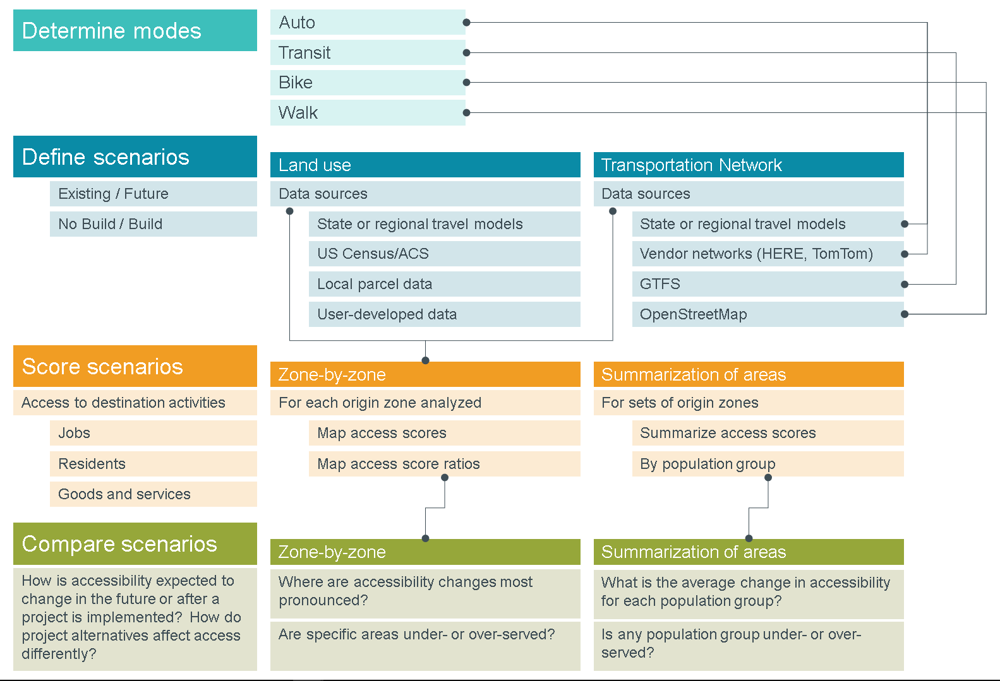
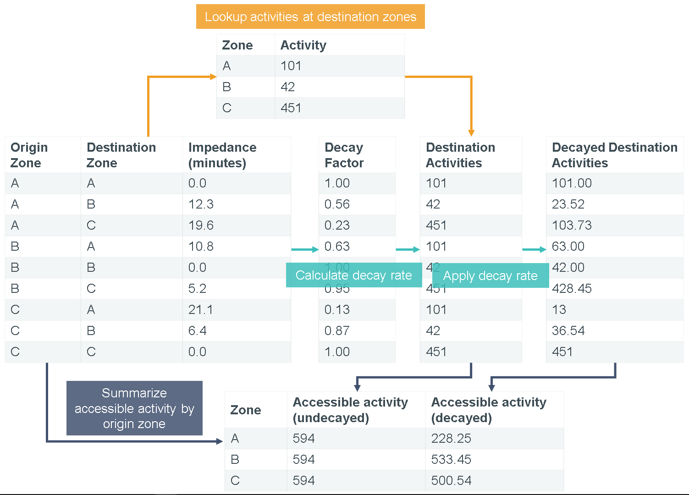

MMA Process Fundamentals
=========================

The process of developing multimodal accessibility scores is simple in concept but 
challenging in practice.  There are many decisions to make along the way, and processing 
data for numerous origin-destination pairs can be computationally cumbersome.  For this 
reason, a set of geoprocessing tools for ArcGIS have been developed to guide analysts 
through the process.  The geoprocessing toolbox is documented `here <mma-toolbox-main.html>`_. 
This section provides insight into the major phases and components of an MMA analysis.

The basic procedures for MMA processing are presented in the diagram below:

	
    *The process of developing accessibility scores starts by determining the modes to be
    analyzed and defining scenarios by selecting appropriate land use and network data.
    Examples of potential data sources are listed in the figure above. Scores are developed 
    for each scenario by using network data to evaluate travel times and summarize the number
    of activities reachable by each population group.  Comparisons across different scenarios
    can provide useful insight for analyzing a variety of planning issues.*

Determine which modes will be analyzed 
---------------------------------------- 
Depending on the focus of the analysis, you may only need to calculate accessibility for a 
single travel mode, such as walking or transit.  In other cases, complete multimodal 
analysis may be required.  The most commonly evaluated modes are walking, biking, transit 
(walk access), and auto.  The modes selected will determine the data used in the analysis.

Define scenarios  
-----------------
What conditions will you analyze and what comparisons are desired?  Scenarios include 
combinations of land use and network data.  Thus, the selection of data sources is critical 
in scenario definition.  Important considerations include the temporal and spatial scope of 
the analysis, the modes to be analyzed, budget for obtaining vendor data, and availability 
of open data sources such as GTFS feeds.  Each scenario can blend alternative land use and 
network data.  For example, suppose you want to assess future accessibility based on 
proposed transportation improvements and in light of potential changes in land use.  You may 
choose to define four scenarios as shown below:

+--------------+-----------------------------------------+
|              |  **Network**                            |
+--------------+-----------------+-----------------------+
| **Land Use** | Existing        | Future                |
+--------------+-----------------+-----------------------+
| Existing     | "Base"          | "Transportation-only" |
+--------------+-----------------+-----------------------+
| Future       | "Land use-only" | "Combined"            |
+--------------+-----------------+-----------------------+

Comparing the “Transportation-only” and “Land use-only” scenarios to the “Base” scenario 
provides insight into how much each component (transportation improvements or land development) 
can be expected to change accessibility over existing conditions.  Comparing the “Combined” 
scenario against the others shows how synergies between transportation and land use interact to 
enhance accessibility above what can be accomplished through focusing only on transportation or 
land use.

Score scenarios
----------------
For a given scenario and for each mode, calculate accessibility scores.  The calculation of scores 
itself is relatively simple, consisting of simple table operations, such as calculating a decay 
factor in a new column; joining activity data based on destination zone IDs; and summarizing 
accessibility activity, grouping by origin ID.  See the figure below for a diagram illustrating 
these steps for three zones.  Optionally, accessibility scores can be summarized for groups of 
origins, with averages weighted by population groups (to keep things simple, this is not shown in 
the diagram).  Using the MMA geoprocessing toolbox, these steps are automated.

	
    *Once a skim has been created, the calculation of access scores is accomplished through a 
    series of simple table joins and field calculations, as shown above.  Results are summarized
    for each origin, making analyses and comparisons by population group possible.*

Accessibility scores, once developed, can be mapped to show heatmaps highlighting the most and least 
accessible zones in the study area.  Comparisons across modes using ratios can also be mapped to show 
the contours of modal competitiveness within the study area. 

.. seealso:: 
    - `Geoprocessing Toolbox - Summarize Accessibility <gp-summarize-accessibility.html>`_

Compare scenarios
------------------
Once each scenario has been scored, comparisons across scenarios can be made.  These comparisons may 
reveal how combined land use and transportation projects enhance accessibility, as described in the 
four-scenario example above.  They may provide insight into how alternative project configurations or 
site locations impact accessibility and travel behavior.  Or they may produce scores for ranking 
projects on a case-by-case basis to prioritize investments.

In all cases, comparisons among scenarios can be made for multi-zone areas to understand the average 
changes in accessibility that would be experienced by different population groups.  Ideally, projects 
will benefit all populations and help connect disadvantaged groups to greater opportunity.  

.. seealso:: 
    - `Geoprocessing Toolbox - Calculate Change in  Accessibility <gp-change-in-accessibility.html>`_
    - `Geoprocessing Toolbox - Calculate Weighted Average <gp-weighted-average.html>`_