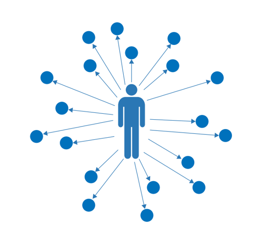
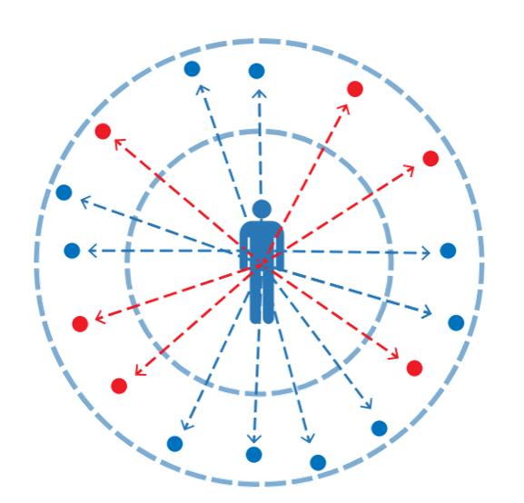
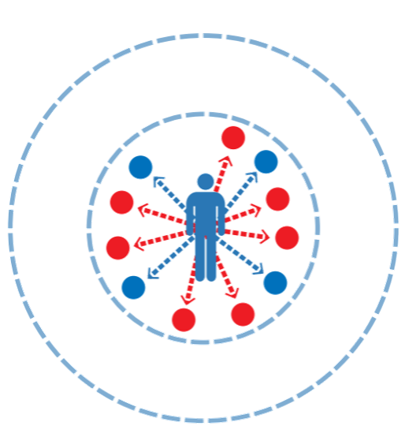

Multimodal Accessibility: Concept and Purposes
==============================================

MMA in Concept
---------------

		to numerous destinations.
	:align: left

We all have important destinations to reach in our daily lives.  
Multimodal accessibility (MMA) analysis measures our ability to reach these destinations.  
It summarizes the number of activities within reach by different travel modes and compares 
results across modes, times of day, and scenarios to understand the universe of opportunity 
available from a given location.  These opportunities define the possibilities for movement 
and inform many aspects of our daily travel patterns, such as when and how we travel, for 
what purposes and to what destinations. 

	

.. sidebar:: Combined Land Use and Transportation Analysis

	|fig1|

	*Accessibility can be increased through mobility solutions, such as 
	transportation projects that allow people to reach distant locations 
	OR through land use solutions that enhance destination proximity* \

	|fig2|

MMA provides an analytical lens to understand the impacts of changes in land use and 
transportation on travel choices.  It is sensitive to new developments and how they are 
designed as well as transportation system design and performance.  By offering measures that 
address each of these critical urban systems, MMA has many uses in urban planning and 
performance measurement applications.  Examples of the kinds of questions MMA can help answer 
include:

- How many jobs can I reach by transit from my house?
- On average, how many jobs can workers in a city reach by transit, by walking, or by driving?
- A proposed highway project promises to improve mobility for many commuters. To what extent does it increase their ability to access key destinations?
- Where does regional transit service offer competitive access to jobs or essential goods and services relative to driving?
- Does any segment of the population have better or worse access to key destinations than another?
- Will a transportation or land use project help create more equitable access to jobs, education, or health care for disadvantaged groups?
- Will increased investment in sidewalks and bike lanes result in a higher proportion of trips using non-motorized modes?

Purposes of MMA Analysis
-------------------------
The simple concept behind MMA analysis – measuring the activities that can be reached by different 
modes – reveals important information about the structure of a place and its connections to its 
surroundings.  These attributes of a place can provide insight into travel behaviors and 
marketability, making accessibility measures a key component in transportation and land use 
forecasting, economic modeling, and project prioritization approaches. 

Structural analysis of neighborhoods, cities, and regions.
^^^^^^^^^^^^^^^^^^^^^^^^^^^^^^^^^^^^^^^^^^^^^^^^^^^^^^^^^^^
MMA offers measures that describe how urban development patterns and transportation system design 
and performance define travel options. Simple MMA cumulative accessibility scores show how many 
jobs, shopping destinations, recreational opportunities, or rooftops are reachable from a given 
location, accounting for travel time and multimodal options.  Advanced analyses show how access 
to opportunity varies by different populations or how connectivity and land use diversification 
limits or enhances access.  Comparisons among peers are natural, revealing structural differences 
across a town or across the country.

- `Accessibility Observatory <http://ao.umn.edu/>`_
- `Brookings "Moving to Access" <https://www.brookings.edu/project/moving-to-access/>`_
- `Smart Location Database <https://www.epa.gov/smartgrowth/smart-location-mapping>`_

Modal Competitiveness
^^^^^^^^^^^^^^^^^^^^^^
By measuring the accessibility offered by different modes, MMA provides natural comparisons across 
modes, describing their relevance and competitiveness for meeting the travel needs of an area. How 
many jobs are reachable by transit versus by driving? Or how many shopping and dining destinations 
are reachable by walking?  The MMA-based answers to these questions help establish the “lift” required 
to provide multimodal transportation options that meet the needs of travelers.  Paired with the 
structural analyses described above, they can also show where and how land use can be part of the 
solution.

- Transit:Auto accessibility ratio (TAR) mapping
- US 15-501 Travel Profile

Travel Behavior 
^^^^^^^^^^^^^^^^
Urban structures and modal interaction are the key factors influencing accessibility scores and the 
competitiveness of various modes.  These factors, in turn, influence travel behaviors. Trips in urban 
places - with walkable destinations, easily accessible transit service, parking constraints and traffic 
congestion - generate different types of trips than suburban or rural locations with different structural 
characteristics and travel options.  All facets of trip-making may be affected, including trip generation 
rates, diurnal trip-making patterns, trip-chaining, mode choice, and trip length.  This means that 
accessibility measures can be useful in understanding travel behaviors at an aggregate scale without the 
need for running more complex travel models. In transportation planning applications, accessibility impacts 
are thus able to differentiate among alternatives at an early stage, enhancing the efficiency of 
transportation decision-making.

- `NCHRP 770 <http://www.trb.org/Main/Blurbs/171138.aspx>`_ (also see `here <http://www.citiesthatwork.com/nchrp-770>`_)
- `TCRP H-51 <http://apps.trb.org/cmsfeed/TRBNetProjectDisplay.asp?ProjectID=3747>`_ (see also `here <http://www.citiesthatwork.com/blog-renaissance/2017/8/2/accessibility-and-millennial-transit-habit>`_)
- Central Maryland Mode Choice Models
- West Palm Beach Sub-Area Study

Project Prioritization
^^^^^^^^^^^^^^^^^^^^^^^
In their daily work, planners analyze land use and transportation systems to understand travel demand and 
development trends, identify needed improvements, and prioritize investments.  MMA measures can provide 
import information for differentiating and ranking projects or alternatives.  They allow projects affecting
different modes to be compared side-by-side in common terms?  For example, a highway project and a transit 
project both are expected to increase access to jobs, but which offers the greatest impact and to what 
groups of residents?  Or a company is planning to open new offices in a city and is considering three 
alternative sites.  Which one will be the most accessible to its employees and by which modes? How will the 
new offices impact travel in the area surrounding each site?

- `Maryland Chapter 30 <http://www.mdot.maryland.gov/newMDOT/Planning/Chapter_30_Score/Index.html>`_
- `Virginia SmartScale <http://vasmartscale.org/>`_
- `Smart Location Calculator <https://www.slc.gsa.gov/slc/>`_
