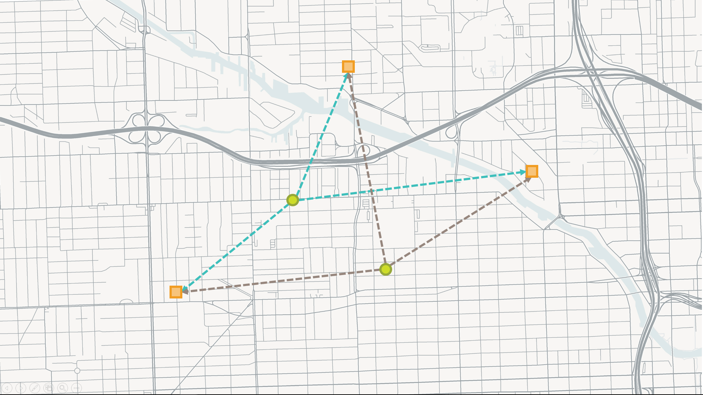
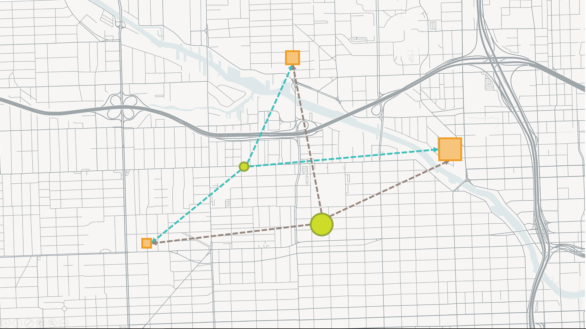
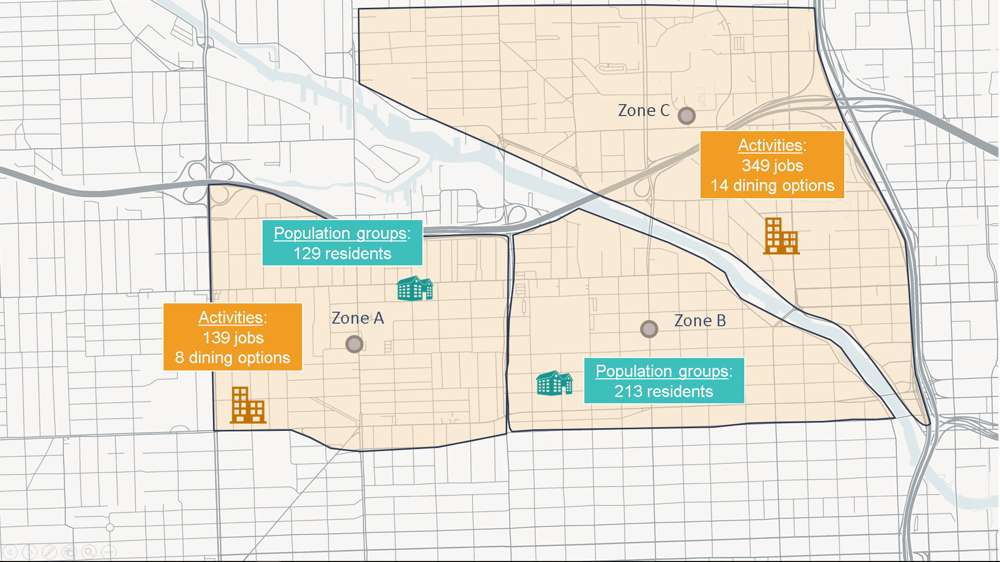
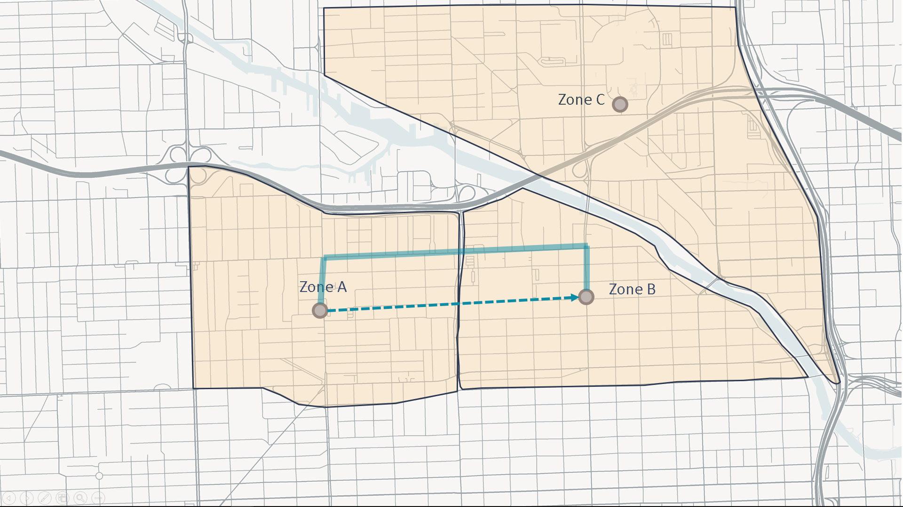
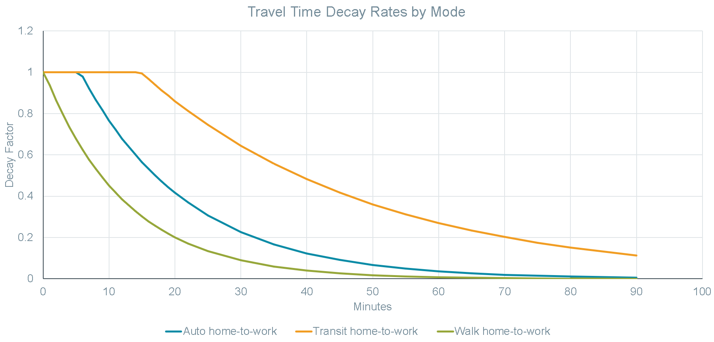

Multimodal Accessibility: Key Terms
=====================================

Origins and Destinations
-------------------------
Any location from which accessibility is measured is referred to as an **“origin”** location
in MMA analysis.  Put simply, origins are places where trips begin.  Usually, many origin 
locations are analyzed across a neighborhood, city, or region.

MMA analysis summarizes what is reachable from a given origin.  Thus, for each origin 
location, there may be numerous **“destination”** locations. Destinations are places where 
trips end.

Origins and destinations are often referred to as “Os” and “Ds.”

        
	
    *Green circles are origins.  Orange squares are destinations.  In MMA analysis, travel 
    opportunity is analyzed from origins to destinations. As shown by the dashed lines, each 
    origin is analyzed based on its connections to the destinations. For most MMA analyses,
    thousands of origins and destinations are analyzed.*

Activities
-----------
Each destination reachable from a given origin is characterized by its own mix and intensity
of **activities**.  In MMA analyses, the term “activities” is a catch-all referring to anything 
a traveler may want to reach.  Examples of activities to which accessibility is measured 
include jobs, shopping and dining, educational resources, health care services, healthy food, 
parks acreage, etc.

Population Groups
------------------
**“Population groups”** are analogous to “activities” at the origin location.  Similar to activities
at destinations, each origin analyzed has its own distinct population composition.  Usually, they 
are segments of the population, such as all residents, transportation-disadvantaged residents, or 
hotel visitors, but they can also include employees or any other group that varies by origin 
depending on the goals of the analysis.

    *Each origin and each destination has different population groups and activities (in terms of type
    and quantity).  In the illustration above,  larger symbols indicate larger numbers of activity or 
    population.*

Zones
------
In reality, origins and destinations are discrete locations.  That is, travel takes place from 
“door to door.” When measuring accessibility, it is useful to work in more general terms. 
Origin population groups and destination activities are dealt with in aggregations called **“zones.”** 
Each zone represents a geographic area in which many population groups or activities may be located. 
Common readily-available zonal aggregation datasets include census blocks and block groups, traffic 
analysis zones (TAZs), and parcels.  Which zonal system is right for a given analysis depends on a 
variety of factors, including the mode being analyzed, the spatial and temporal scopes of an 
analysis, and the richness of the available data. 

    *To simplify analysis, discrete origin and destination locations – along with their population groups 
    and activities – are aggregated into zones.  Travel impedances are analyzed between zone centroids, 
    shown in the grey circles above.  In this example, the zonal geography would be too coarse for walk 
    analysis, but may be suitable for auto analysis.*

- *Coming soon: Determinants of Zone Size*

Centroids
----------
For MMA analysis purposes, zones condense all activities and population groups within the zonal 
boundaries to a single point called a **“centroid.”** Centroids generally represent the approximate center
of activity within each zone.  The use of centroids simplifies processing by representing each zone
and its activities and population groups as a single point rather than as a complex polygon.  
Centroids work best when it is reasonable to suppose that the perceived impedance of travel is similar 
for all locations within each zone.

Impedance
----------
Accessibility depends on how easy it is to reach destination zones from a given origin zone. Some 
destinations are nearer than others, and travel conditions - such as congested highways or infrequent 
transit service - can sometimes make nearby destinations hard to reach in a timely manner.  In MMA 
analysis, the term **“impedance”** refers to any measure of the ease of traveling from an origin zone to 
a destination zone. Impedance is usually measured in travel time or distance, but it can also be 
measured in cost, such as fuel expenses and parking costs for personal vehicle travel or fares for 
shared mobility (transit, taxi, Uber, e.g.) or through generalized cost functions that take into 
account a wide variety of factors.

    
	
    *Impedance can be analyzed based on simple spatial relationships or based on network analysis.  The 
    example above illustrates impedance estimation from Zone A to Zone B.  Using spatial analysis, the 
    distance between the zonal centroids is measured and used as the basis for impedance estimation.  
    Using network analysis, the lowest-cost (shortest travel time, e.g.) route is found based on network 
    connectivity and attributes, such as average travel speeds.*

Spatial Analysis of Impedance
^^^^^^^^^^^^^^^^^^^^^^^^^^^^^^
One way of understanding the impedance between an origin and destination zone is to consider the distance 
between them (usually between their centroid points).  It is generally reasonable to assume that nearby 
destinations are easier to reach than those far away.  Using **spatial analysis** to estimate impedances 
between origin and destination zones can provide a useful means of quickly estimating accessibility with 
minimal data requirements.  It can also offer a benchmark for evaluating how well- connected places are based 
on the networks that serve them (see “Network Analysis of Impedance”).

Network Analysis of Impedance
^^^^^^^^^^^^^^^^^^^^^^^^^^^^^^
Determining the impedances between origin and destination zones is best accomplished through **network analysis**.  
Networks approximate real-world conditions on the transportation system and bring greater precision to 
accessibility analysis than can be achieved through simple spatial estimates.  Network datasets have strict 
rules for determining where and how locations connect to each other.  There are numerous algorithms used to 
determine the shortest path between two zones and for analyzing many origin-destination pairs at a time. 

- The MMA geoprocessing tools rely on `ESRI's ArcGIS Network Analyst Extension <http://desktop.arcgis.com/en/arcmap/latest/extensions/network-analyst/what-is-network-analyst-.htm>`_

Skims
------
The impedance values between origin zones and reachable destination zones are recorded in a matrix called a 
**“skim.”**  In MMA processing, the skims are stored as tables in which each row represents an origin-destination 
pair. Columns in the skim table identify the specific O-D pair and the impedance of the shortest path from 
the origin zone to the destination zone.

Example of a skim table

============= ================== ====================
Origin Zone   Destination Zone   Impedance (minutes)
============= ================== ====================
A             A                  0.0
A             B                  12.3
A             C                  19.6
B             A                  10.8
B             B                  0.0
B             C                  5.2
C             A                  21.1
C             B                  6.4
C             C                  0.0
============= ================== ====================

*A skim is a table that records the impedance associated with traveling between each origin-destination
pair.  A skim is also sometimes called an "OD Matrix."*

.. seealso:: 
    - `Geoprocessing Toolbox - Create Skim <gp-create-skim.html>`_
    - `Geoprocessing Toolbox - Create Average Matrix <gp-average-matrix.html>`_
    - `mma.Skim <mma.html#mma.Skim>`_

Decay Rates
------------
As impedance to a destination increases, it is reasonable to suggest that the destination’s relevance to 
the origin’s accessibility diminishes. For example, suppose zone *j* has 100 jobs in its area and is 
reachable from zones *i* and *k*.  In simple terms, those 100 jobs are accessible from both zone *i* and 
zone *k*.  However, it takes 35 minutes to reach those jobs from zone *k*, and just 12 minutes to reach 
them from zone *i*.  Which origin zone has the greater accessibility? 

Decay rates allow accessibility results to account for the value of time.  They provide a formula to 
translate impedance into discount factors that can then be applied to activities at destinations when 
summarizing accessibility for each origin.  In the example above, the 100 jobs at zone *j* might be 
discounted so that they are effectively equivalent to 88 jobs from zone *i* and 46 jobs from zone *k*, 
taking into account the time it takes to reach them from each origin zone.

    
	
    *Decay rates define how to discount destination-end activities based on the impedance between the 
    origin and the destination.  They often vary by mode and travel purpose.  A collection of curves 
    modeling decay based on travel time for the auto, walk, and transit modes for home-to-work trips 
    is shown in this illustration.*

Decay rates are an optional component of MMA analysis, but they can significantly impact results and 
enhance their relevance and explanatory power.

.. seealso:: 
    - `Geoprocessing Toolbox - Manage Decay Rates <gp-decay-rates.html>`_
    - `mma.Decay <mma.html#mma.Decay>`_

Weighted Averages
------------------
All of the elements of accessibility analysis described in this section yield estimates of access to 
activities at a zonal level.  When the aim of the analysis is to describe accessibility for an area 
consisting of multiple origin zones, averages based on the zones’ population groups must be calculated.
This approach to calculating averages for aggregated data (zones) based on the distribution of values
(population groups) across each record is called a **weighted average.**

Example of a weighted average calculation

+------+-------------+------------+--------------------------+---------------------------+-----------------------------------------+
| Zone | AccessScore | Population | Disadvantaged Population | Access Score * Population | Access Score * Disadvantaged Population |
+======+=============+============+==========================+===========================+=========================================+
| A    | 5,000       | 550        | 325                      | 2,750,000                 | 1,625,000                               |
+------+-------------+------------+--------------------------+---------------------------+-----------------------------------------+
| B    | 3,000       | 1,630      | 150                      | 4,890,000                 | 450,000                                 |
+------+-------------+------------+--------------------------+---------------------------+-----------------------------------------+
| C    | 10,500      | 920        | 630                      | 9,660,000                 | 6,615,000                               |
+------+-------------+------------+--------------------------+---------------------------+-----------------------------------------+
| SUM  | (NA)        | 3,100      | 1,105                    | 17,300,000                | 8,690,000                               |
+------+-------------+------------+--------------------------+---------------------------+-----------------------------------------+

The weighted average *AccessScore* for combined zones *A*, *B*, and *C* depends on which population group
is being considered.  For the general population (*Population* field), the weighted average is the sum of
the product of each zone's *Population* and *AccessScore* values, divided by the total *Population* in all
three zones.  A similar approach is taken for the *Disadvantaged Population*, but the resulting value will
be different because the distribution of population across the three zones is different for each population
group.

- Average *AccessScore* for *Population* = 17,300,000/3,100 = **5,581**
- Average *AccessScore* for *Disadvantaged Population* = 8,690,000/1,105 = **7,864**

In this example, the disadvantaged population has a higher average access score than the
general population.

.. seealso:: 
    `Geoprocessing Toolbox - Calculate Weighted Average <gp-weighted-average.html>`_