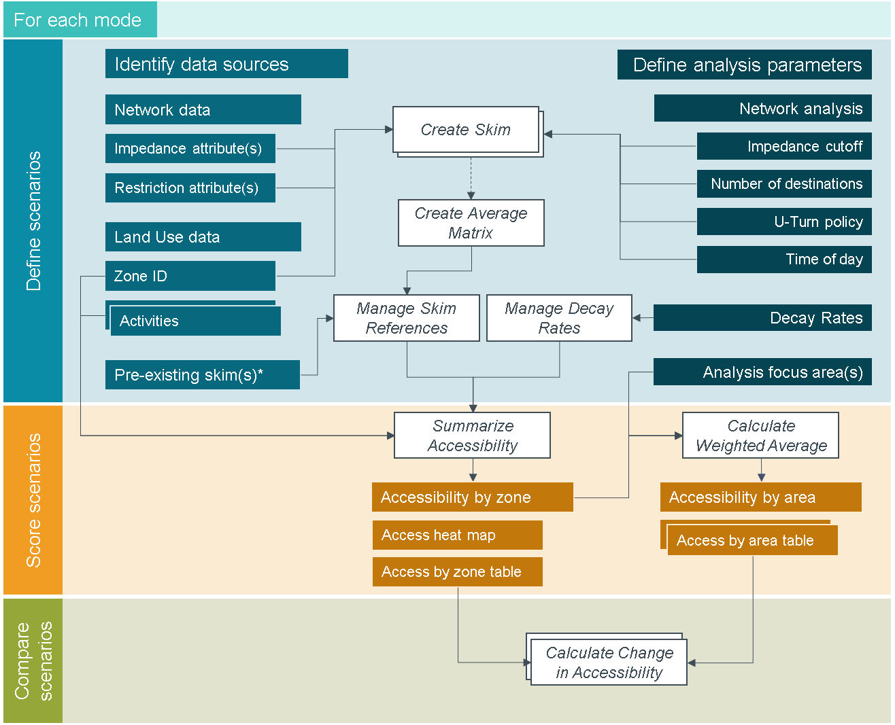

==========================
MMA Geoprocessing Toolbox
==========================

.. toctree::
    :maxdepth: 1
    :caption: Overview:

    Calculate Change in Accessibility <gp-change-in-accessibility>
    Calculate Weighted Average <gp-weighted-average>
    Create Average Matrix <gp-average-matrix>
    Create Skim <gp-create-skim>
    Manage Decay Rates <gp-decay-rates>
    Manage Skim References <gp-manage-skims>
    Summarize Accessibility <gp-summarize-accessibility> 
    mma python module <mma>

MMA analysis can be facilitated using a suite of geoprocessing tools for ArcGIS.  The tools
simplify the creation and processing of skims using Network Analyst to produce, summarize,
and compare accessibility scores. Each tool can be accessed through the familiar ArcGIS geoprocessing
interface.  A brief description of each tool is provided below. Click on the tool heading for detailed
information.

`Calculate Change in Accessibility <gp-change-in-accessibility.html>`_
    Evaluate the differences between the accessibility scores reported for an overlapping set of
    origin zones.  Accessibility scores reported in the "no build" table are subtracted from those
    reported in the "build" table to return the change in accessibility. This tool is useful for
    mapping the differences between scenarios.

`Calculate Weighted Average <gp-weighted-average.html>`_
    Calculate areawide average accessibility scores or change in accessibility scores based on the 
    distribution of population groups in a collection of origin zones.  Among other uses, the weighted average 
    calculation is useful for equity analyses by comparing the accessibility experienced by different segments 
    of the population.

`Create Average Matrix <gp-average-matrix.html>`_
    If multiple skims are developed representing a consistent set of potential O-D pairs (using a travel time window
    or alternative network parameters, e.g.), it may be desirable to summarize the average impedance between each 
    O-D pair describing a single “typical” impedance for MMA processing. 

`Create Skim <gp-create-skim.html>`_
    Using network analysis to create skim tables is a critical component in MMA processing.  This tool provides a 
    single interface for setting up the details of a network analysis and creating output skim files.  

`Manage Decay Rates <gp-decay-rates.html>`_
    Decay rates define how to discount activities at different destinations based on the cumulative impedance 
    (usually travel time) from the origin. Create decay rate configuration files and manage their parameters for
    MMA processing using this tool.

`Manage Skim References <gp-manage-skims.html>`_
    When accessibility is summarized in the *Summarize Accessibility* tool, skims are processed based on skim
    reference configuration files.  These files are automatically generated by the *Create Skim* tool, so this
    tool is only required if working with exogenous skims or if analysis paramters change such that the skim
    should be processed differently (using an alternative impedance field, e.g.).

`Summarize Accessibility <gp-summarize-accessibility.html>`_
    Generate accessibility scores for a set of skim files and a table of land use data. 

Typical Geoprocessing Workflow
---------------------------------
The figure below shows the typical geoprocessing workflow for generating accessibility scores and making 
comparisons among scenarios.  The phasing aligns with that displayed in the `MMA Process Fundamentals <basic-process.html>`_ 
section.  The hollow boxes represent the MMA geoprocessing tools, showing the specific aspects of the 
scoring process they support and depend on.

    

    *For each mode, define the land use and network data and parameters associated with a given scenario. 
    produce and manage skims and decay rates before summarizing accessibility by zone.  Aggregate results
    for study areas of special interest as needed.  Finally, compare scenario results and report your findings.*

Analysis is undertaken for each mode.  Scenarios are defined by selecting data reflecting the combination of
network and land use parameters to use for processing. A "base" scenario is likely to be created using existing
land use and network data, for example.  If analyzing the accessibility impacts of a potential transit service
improvement project, the existing land use data may remain, but an alternative transit ntework will be needed 
reflecting the improved services.

For each scenario, land use centroid locations are loaded on to the network to produce one or more skims.  In 
some cases, the resulting skims may require additional processing to reduce multiple skims into a single "typical" 
condition, or to properly configure the skim reference files. Use decay rates to properly discount destination-end 
activities based on travel impedance for the current mode and scenario.  

Summarize accessibility scores to create data and map products for visualization and additional analysis as needed.

Finally, compare accessibility results - by zone or in aggregated study areas - to understand how changing conditions
impact accessibility. 

.. seealso:: 
    `mma python module <mma.html>`_

.. note:: 
    **Dependencies**
    
    - arcpy (installs with ArcGIS) v. 10.2 or later

    - numpy v. 1.11.2 or later

    - pandas v. 0.18.1 or later