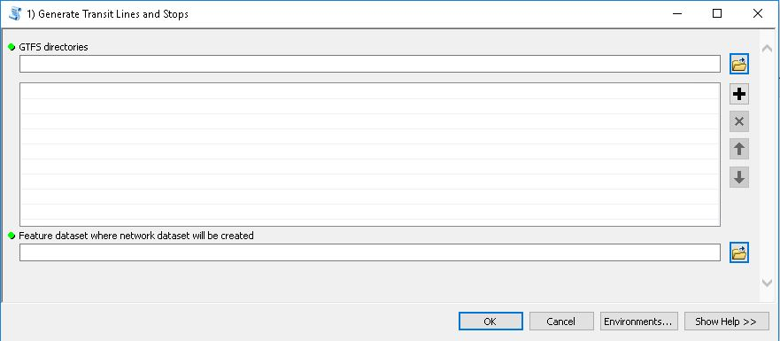
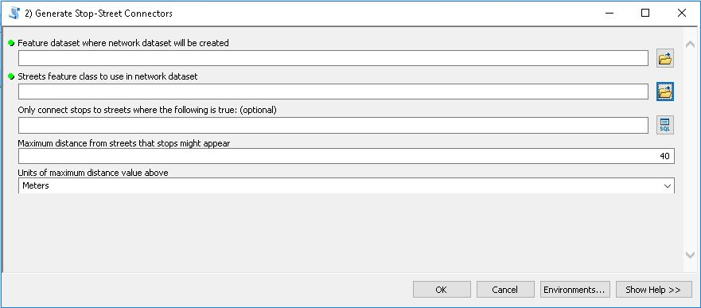
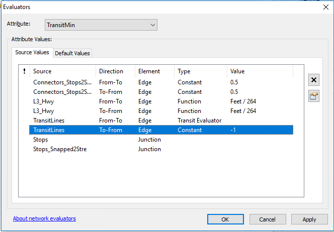
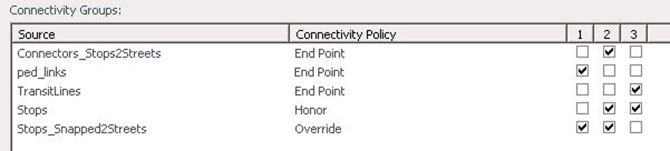
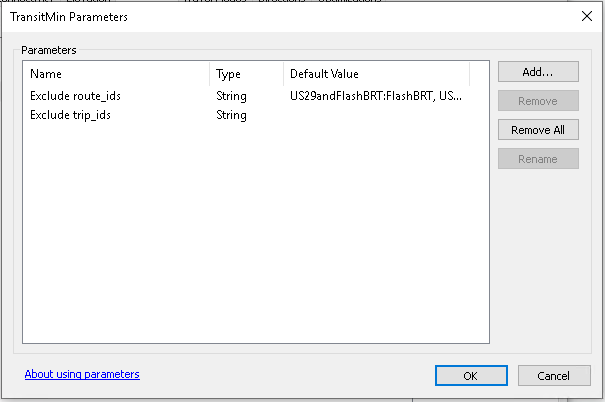
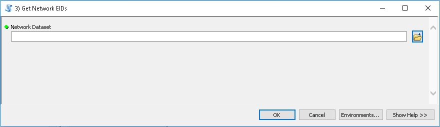

Network setup
----------------------------------------------------

To score projects, Network Datasets must be created to represent both the existing 
and project transportation networks. These networks are stored in their own geodatabases 
which are created in the Networks folder.  Several steps in this process require the use
of the `Add GTFS to a Network Dataset <http://esri.github.io/public-transit-tools/AddGTFStoaNetworkDataset.html>`_
toolbox.

.. SeeAlso:: 
    - `Basic instructions on creating a network dataset <http://desktop.arcgis.com/en/arcmap/latest/extensions/network-analyst/creating-a-network-dataset.htm>`_
    - `Add GTFS to a Network Dataset User Guide <https://github.com/Esri/public-transit-tools/blob/master/add-GTFS-to-a-network-dataset/UsersGuide.md>`_.

Step 1: Create feature dataset
~~~~~~~~~~~~~~~~~~~~~~~~~~~~~~~~~~~~~~~~~~~~~~~~~~~~~~

Create a feature dataset within the appropriate geodatabase for a given project. 
This feature dataset will house the required feature classes to build a network dataset. 
Import the MSTM Level 3 highway network into the feature dataset.

Step 2: Generate transit lines and stops
~~~~~~~~~~~~~~~~~~~~~~~~~~~~~~~~~~~~~~~~~~~~~~~~~~~~~~

Feature classes are created from the GTFS feeds to represent both the base network and 
project scenarios and should be added to the feature dataset created during Step 1. This
step uses the “1) Generate Transit Lines and Stops” from the "Add GTFS to a Network Dataset" 
tool.

GTFS data are used to create line and point features classes and build a SQL database of the
transit schedule described in the GTFS feed. These will be stored in the working geodatabase 
containing the network dataset built in Step 1. All GTFS feeds should be loaded onto the network
at one time, including feeds created to model new projects. As described below, routes and trips
available under proposed projects can be excluded to reflect existing service by creating network
parameters.

+-------------------------------+-------------------------------------------------+
| Field                         | Description                                     |
+===============================+=================================================+
| GTFS directories              | GTFS feeds covering the state + project feed(s) |
+-------------------------------+-------------------------------------------------+
| Feature dataset where network | Feature dataset (sits within GDB) where the     |
| dataset will be created       | network will be created.                        |
+-------------------------------+-------------------------------------------------+

.. note::  Each scenario should be in a separate geodatabase.

Step 3: Generate Stop-Street Connectors
~~~~~~~~~~~~~~~~~~~~~~~~~~~~~~~~~~~~~~~~~~~~~~~~~~~~~~

Run the “2) Generate Stop Street Connectors” tool in the “Add GTFS to a Network Dataset” tool. 
This step creates connections between transit stop locations and the roadway network to allow 
interaction between transit lines and the access/egress network. The output files should be stored 
in the feature dataset created in Step 1. In the case of Chapter 30 scoring, the streets feature 
class is the MSTM Level 3 network which was already imported. 

+-----------------------------------------------------------------------+----------------------------------------------------------------------+----------------------------------------------+
| Field                                                                 | Description                                                          | Recommended Value                            |
+=======================================================================+======================================================================+==============================================+
| Feature dataset where network dataset will be created                 | Feature dataset where the network will be created.                   | Geodatabase for project                      |
+-----------------------------------------------------------------------+----------------------------------------------------------------------+----------------------------------------------+
| Streets feature class to use in network dataset                       | Streets features: Level 3 MSTM network imported into feature dataset | Output of 1)Generate Transit Lines and Stops |
+-----------------------------------------------------------------------+----------------------------------------------------------------------+----------------------------------------------+
| Only connect stops to streets where the following is true: (optional) | Optional connection criteria.                                        | L3_Hwy                                       |
+-----------------------------------------------------------------------+----------------------------------------------------------------------+----------------------------------------------+
| Maximum distance from streets that stop might appear                  | Maximum distance value.                                              | 100                                          |
+-----------------------------------------------------------------------+----------------------------------------------------------------------+----------------------------------------------+
| Unit of maximum distance value above                                  | Maximum distance unit.                                               | Feet                                         |
+-----------------------------------------------------------------------+----------------------------------------------------------------------+----------------------------------------------+

.. note::  
    In order to run the Generate Stop-Street Connectors tool, you must have the Desktop Standard or 
    Advanced license.  If using the Basic license, use the alternative tool provided in the
    `Chapter 30 Project Scoring Toolbox <Ch30ToolboxOverview.html>`_

Step 4: Build Network Dataset
~~~~~~~~~~~~~~~~~~~~~~~~~~~~~~~~~~~~~~~~~~~~~~~~~~~~~~

Once all feature classes are created, right click the feature dataset in the catalog view to 
create a new network dataset. During network dataset creation, evaluators for calculating travel 
times on the network and connectivity rules must be established. The two screens below show the 
recommended evaluator and connectivity group settings for Chapter 30 transit analysis. Pay close 
attention to the Connectivity Policy in the connectivity group settings step. 

	
	

Parameters should be added to your transit evaluators that will allow you to modify later analyses by
excluding specific routes or trips. These parameters must be a "String" data type and named exactly 
"Exclude route_ids" and "Exclude trip_ids" to work properly. The values entered can be a single or 
list of route or trip IDs prefixed with the name of the GTFS dataset and a colon. The pictures below 
show an example of these parameters with a default exclusion included. Please see the `Add GTFS to a 
Network Dataset <https://github.com/Esri/public-transit-tools/blob/master/add-GTFS-to-a-network-dataset/UsersGuide.md#ExcludeRoutes>`_ 
documentation on excluding routes and trips for more information.

Step 5: Get Network EIDs
~~~~~~~~~~~~~~~~~~~~~~~~~~~~~~~~~~~~~~~~~~~~~~~~~~~~~~

Run the “3) Get Network EIDs” tool in the “Add GTFS to a Network Dataset” tool. After creating 
and building the network dataset, this script prepares the network for use in Network Analyst.

+-----------------+-----------------------------------+
| Field           | Description                       |
+=================+===================================+
| Network Dataset | The built transit network dataset |
+-----------------+-----------------------------------+

.. note::  
    This tool retrieves the network dataset’s edge IDs (EIDs) for the transit lines features and 
    adds the EIDs to a SQL table that will be referenced by the GTFS transit evaluator. The network 
    dataset must be built prior to running this tool, and the tool must be re-run every time the 
    network dataset is rebuilt in order to update the EID values.

.. warning::  
    Quality checks are required once networks are built. Run the 
    `Routing Problems </en/latest/quality-assurance.html#routing-problems>`_ 
    and `Service Area Problems </en/latest/quality-assurance.html#service-area-problems-travel-time-contours>`_ 
    quality checks before continuing.