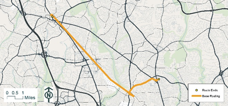
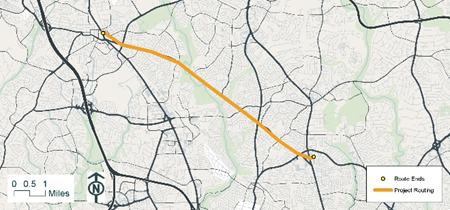
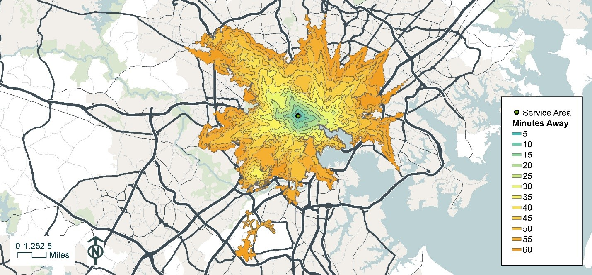
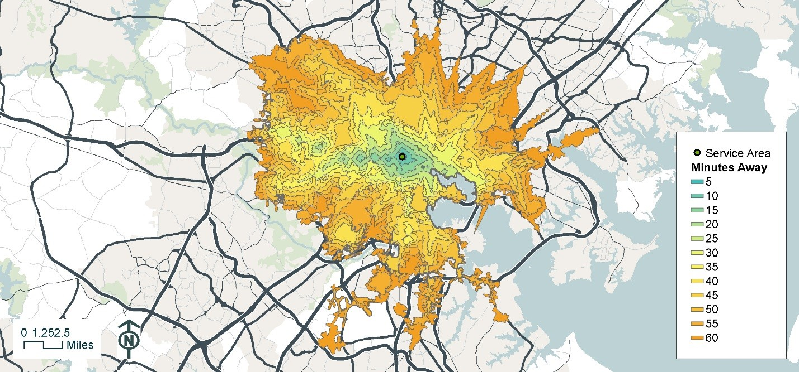

========================================
Chapter 30 Quality Assurance
========================================

GTFS feed validation
~~~~~~~~~~~~~~~~~~~~~~~~~~~~~~~~~~~~~~~~~~

**Google FeedValidator**

GTFS feeds should be validated using the Google `FeedValidator utility <https://github.com/google/transitfeed/wiki/FeedValidator>`_. 
Tool documentation is available on the `tool's wiki page <https://github.com/google/transitfeed/wiki/FeedValidator>`_. This tool 
will check for a variety of GTFS feed issues, including:

- Missing files
- Missing table columns, rows, and values
- Coding errors
- Basic GTFS geometry

A full list of errors identified by this tool is included in the FeedValidator utility documentation.

**Additional Validation**

When the FeedValidator utility detects errors in a GTFS feed, appropriate modifications should be made to the GTFS feed 
to correct the issue. In some cases, errors produced by the validator will require futher investigation to identify the
root cause.

As part of the 2019 socring process, a script was written in R to provide additional validation information 
beyond what the FeedValidator utility provides. Specifically, the script identifies stop-to-stop pairs in a 
given GTFS feed for which the feed's schedule information suggests abnormally fast or abnormally slow 
transit vehicle travel speeds. The tool, provided in the form of a R Markdown file, computes transit 
vehicle speed based on the linear distance between stops and the transit schedules present in the feed. 
The tool produces tables and maps of station pairs with servie speeds less than 4.3 miles per hour (7 kmph) or 
greater than 89 miles per hour (110 kmph).

The script was used to identify and map all stop-to-stop pairs with very high or very low speeds in the 
GTFS feeds used for Chapter 30 scoring. While resolving these schedule anomalies was beyond the scope of 
the transit project scoring effort, the maps help provide insight into the quality of the supporting GTFS 
data for future reference. These represent the base (no-build) network feeds, which are common to all 
scored projects. As such, each project's relative score remains a reliable estimate of the accessibility 
and travel time savings benefits of the project.

Maps and tables of stop-to-stop speeds are provided via the links listed below. Only feeds having
speed issues are shown.  Maps display speeds in kmph.

.. toctree::
    :maxdepth: 2
    :caption: Quality assurance checks:

    GTFS feed validation of travel speeds appendix <Speed-validation-results>

.. note::  
    The stop-to-stop speed tool discussed in this section can be `accessed here 
    <https://bitbucket.org/renaissancelabs/docs/src/master/scripts/GTFS_Speed_Check.Rmd>`_. R and R Studio 
    are required to run the script.

Routing problems
~~~~~~~~~~~~~~~~~~~~~~~~~~~~~~~~~~~~~~~~~~

To confirm the project networks are properly configured, a network routing test should be conducted on 
both the base and project networks to identify the shortest path between two points. For these tests, 
beginning and ending points are identified near the termini of the project. The purpose of this test 
is to confirm that the network is utilizing the new path created by the project. If the build and no-build 
networks are configured properly, the build scenario route should traverse the proposed network segment. 
This test may also show a travel time reduction. Additional detail on Route analysis in Arcmap and Network 
analyst is available here. Recommended settings include:

- A 8:00 AM departure time
- Use the travel time evaluator create during network development
- Route endpoints should be near the project termini

The below example from the 2018 scoring illustrates the results of this test. The top map shows a base
 case route between Montgomery College and Wheaton Metro Station and the bottom map shows the route 
 with BRT project in place. Additional detail on this project can be found here.

The below example from the 2018 scoring illustrates the results of this test. The top map shows a 
base case route between Montgomery College and Wheaton Metro Station and the bottom map shows the 
route with BRT project in place. Additional detail on this project can be found here [ADD LINK TO PROJECT 32 PDF HERE].

No-Build Route Montgomery College to Wheaton Metro Station at 8:00 am

Build Route Montgomery College to Wheaton Metro Station at 8:00 am 

Service area problems (travel time contours)
~~~~~~~~~~~~~~~~~~~~~~~~~~~~~~~~~~~~~~~~~~~~

A service area analysis should be conducted under build and no-build scenarios for each project. 
The result of this analysis is a map of travel time isochrones for a single location within the 
project study area. A simple check that the isochrones expand as the project provides additional 
service and that the expansion is intuitive given the nature of the project is sufficient to confirm 
that the project is appropriately integrated into the base multimodal network. A Service Area test in 
Network Analyst, which is documented here, is used to conduct this test. The following settings are 
recommended:

- Breaks in 5 minute increments between 5 and 60 minutes
- Departure time on typical Wednesday at 8:00 AM
- Direction should be away from the facility
- Use the travel time evaluator create during network development
- Start points should be along the project

The below example from the 2018 scoring illustrates the results of this test. The top map shows a base 
case service area from N. Carey St and W. Franklin St. and the bottom map shows the same service area 
with project in place. Additional detail on this project can be found here.

		

No-Build Service Area from North Carey St @ West Franklin St. at 8:00 am

Build Service Area from North Carey St @ West Franklin St. at 8:00 am