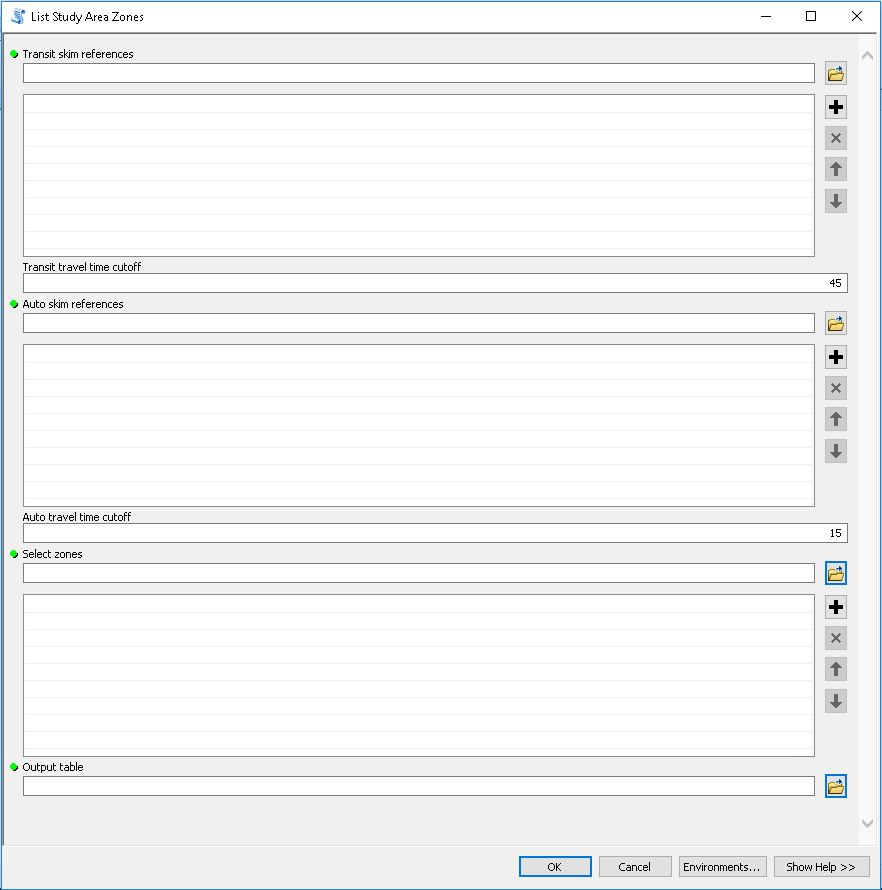

Chapter 30 Score Development
=====================================

1. Define project study area
~~~~~~~~~~~~~~~~~~~~~~~~~~~~~~~~~~~~~~

The `List Study Area Zones <Ch30ToolboxOverview.html>`_ tool is used to create a table defining all zones
within the project study area.

The project study area is based on travel time to the zones in which the project is implemented. 
Project zones are zones intersecting project features (new stops, stops affected by frequency 
enhancements, e.g.). Any zones within 45 minutes by transit (in the project no-build scenario) are 
part of the study area as are any zones within 15 minutes by driving (based on MSTM highway skims,
which are provided as an a priori data source to inform this step of score development).

+----------------------------+--------------------------------------------------------------------------------+------------------------------+
| Field                      | Description                                                                    | Recommended Value            |
+----------------------------+--------------------------------------------------------------------------------+------------------------------+
| Transit skim reference     | The transit skim reference files point to the transit skim(s) that             |                              |
+----------------------------+--------------------------------------------------------------------------------+------------------------------+
| Transit travel time cutoff | define average OD travel times for the project “no-build” condition.           | 15 minutes                   |
|                            |                                                                                |                              |
+----------------------------+--------------------------------------------------------------------------------+------------------------------+
| Auto skim reference        | The auto skim reference files point to the auto skim(s) that define            |                              |
|                            | average OD travel times for the base condition.                                |                              |
+----------------------------+--------------------------------------------------------------------------------+------------------------------+
| Auto travel time cutoff    | Zones that can reach the "project zones" within the auto travel time cutoff    | 15 minutes                   |
|                            | will be included in the study are definition.                                  |                              |
|                            |                                                                                |                              |
+----------------------------+--------------------------------------------------------------------------------+------------------------------+
| Select zones               | To look up which zones meet the above travel time criteria (consistent         | L2 zones                     |
|                            | with the study area definition), the tool must know the “project zones” (zones |                              |
|                            | that overlap affected project features). Each project zone ID is listed here,  |                              |
|                            | either as separate entries or as a semicolon-delineated list of values.        |                              |
+----------------------------+--------------------------------------------------------------------------------+------------------------------+
| Output table               | The user specifies the study area definition table to be produced by           |                              |
|                            | the tool.                                                                      |                              |
+----------------------------+--------------------------------------------------------------------------------+------------------------------+

2. Map project study area
~~~~~~~~~~~~~~~~~~~~~~~~~~~~~~~~~~~~~~~~~~

The `Map Study Area <Ch30ToolboxOverview.html>`_ tool is used to plot a table of project study area zones (created
using the List Study Area Zones tool) on a map.

+----------------------------------------+---------------------------------------------------------------------------------+------------------------------+
| Field                                  | Description                                                                     | Recommended Value            |
+----------------------------------------+---------------------------------------------------------------------------------+------------------------------+
| Study area table                       | The study area zones table is a table containing a list of zones                |                              |
|                                        | included in the project study area (this can be generated using the “List study |                              |
|                                        | area zones” tool).                                                              |                              |
+----------------------------------------+---------------------------------------------------------------------------------+------------------------------+ 
| Study area zone ID field               | The study area zoneID field is the field in the study area zones table to       | “STUDY_AREA” is the default  |
|                                        | reference when looking up which zones are in the study area.                    |                              |
+----------------------------------------+---------------------------------------------------------------------------------+------------------------------+
| Zones features                         | The zones feature class is a polygon feature class that will be used to         |                              |
|                                        | map the study are based on the zone values in the zone features ID field        |                              |
+----------------------------------------+---------------------------------------------------------------------------------+------------------------------+
| Zone features ID field                 | The zone IDs listed in the study area zones table.                              |                              |
+----------------------------------------+---------------------------------------------------------------------------------+------------------------------+
| Output layer name (optional)           | The tool produces a feature layer, querying the zones feature class             |                              |
|                                        | based on values in the study area zones table; the resulting layer name can be  |                              |
|                                        | specified here. If blank, the layer name will be given a random unique name.    |                              |
+----------------------------------------+---------------------------------------------------------------------------------+------------------------------+
| Create output feature class (optional) | Optionally, the results can be dissolved into a single feature                  |                              |
|                                        | representing the project study area.  If                                        |                              |
|                                        | this option is selected, provide an output feature class.                       |                              |
+----------------------------------------+---------------------------------------------------------------------------------+------------------------------+
| Output feature class (outional)        | Location to save dataset.                                                       |                              |
+----------------------------------------+---------------------------------------------------------------------------------+------------------------------+

**Map project study area output**

3. Calculate weighted average
~~~~~~~~~~~~~~~~~~~~~~~~~~~~~~~~~~~~~~~~~

The `Calculate Weighted Average <gp-weighted-average.html>`_ tool summarizes the average accessibility score for a collection
of zones based on the distribution of popuation groups in those zones.  For Chapter 30 scoring, this tool needs to be run
twice - once to generate average change in access to jobs scores for the general population and once to generate average
change in access to jobs scores for disadvantaged populations.  The provided MSTM Level 2 zones contain the appropriate
population group data.  In both cases, the table of project study area zones should be used to select a subset of MSTM
level 2 zones, allowing the average change in access to be assessed only for zones in the project study area.

.. figure:: ../images/CalculateWeightedAverage.JPG

+-------------------------------------------------+-------------------------------------------------------------------------------------------------------+------------------------------+
| Field                                           | Description                                                                                           | Recommended Value            |
+-------------------------------------------------+-------------------------------------------------------------------------------------------------------+------------------------------+
| Input table                                     | The input table is the table of zonal accessibility scores from which                                 |                              |
|                                                 | the weighted average will be calculated                                                               |                              |
+-------------------------------------------------+-------------------------------------------------------------------------------------------------------+------------------------------+
| Value fields                                    | The value fields are the fields for which a weighted average score will                               |                              |
|                                                 | be calculated.  The weighted average of “HBWA_TOTAL” will be produced                                 |                              |
|                                                 | in this example (not visible due to length of field list).                                            |                              |
+-------------------------------------------------+-------------------------------------------------------------------------------------------------------+------------------------------+
| Weight fields                                   | The weight fields are the fields that inform the weighting in the                                     |                              |
|                                                 | weighted average calculation.  For a population-weighted average, for                                 |                              |
|                                                 | example, choose the field representing zonal populations in this list                                 |                              |
|                                                 | (POP_2015 field not visible due to length of list).                                                   |                              |
+-------------------------------------------------+-------------------------------------------------------------------------------------------------------+------------------------------+
| Select features from the input table (optional) | A SQL query can be specified to allow the user to run the analysis for                                |                              |
|                                                 | specific zones in the table (this will generally not be necessary for Chapter                         |                              |
|                                                 | 30 scoring purposes).                                                                                 |                              |
+-------------------------------------------------+-------------------------------------------------------------------------------------------------------+------------------------------+
| Select subset (optional)                        | The “Select subset” option allows the user to utilize features or table                               |                              |
|                                                 | records from another data source (such as the study area definition tables,                           |                              |
|                                                 | e.g.) to limit the records that will be utilized in the development of weighted                       |                              |
+-------------------------------------------------+ average results.                                                                                      +                              +
| Selection method (optional)                     |                                                                                                       |                              |
|                                                 |                                                                                                       |                              |
|                                                 | If the “Selection method” is “SPATIAL”:                                                               |                              |
+-------------------------------------------------+                                                                                                       +                              +
| Reference layer (optional)                      | The user may define a reference feature layer or feature class for selecting                          |                              |
|                                                 | features to analyze (the input table must also be a feature layer for this                            |                              |
|                                                 | option to work)                                                                                       |                              |
+-------------------------------------------------+                                                                                                       +                              +
| Select features from reference layer (optional) |                                                                                                       |                              |
|                                                 | A SQL expression can be defined to focus on specific features in the reference                        |                              |
|                                                 | layer                                                                                                 |                              |
+-------------------------------------------------+                                                                                                       +                              +
| Spatial relationship (optional)                 | The spatial relationship and selection tolerance (search distance) can be set to                      |                              |
|                                                 | define which features in the input table will be selected based on their                              |                              |
|                                                 | spatial relationship to features in the reference layer.                                              |                              |
+-------------------------------------------------+                                                                                                       +                              +
| Search distance (optional)                      | If the “Selection method” is “TABULAR”:                                                               |                              |
|                                                 |                                                                                                       |                              |
+-------------------------------------------------+ The user may define a reference table for selecting feature to analyze.  The features                 +                              +
| Reference table (optional)                      | in the input table to select will be those with common values in the reference table                  |                              |
|                                                 | key field and the input table lookup field                                                            |                              |
+-------------------------------------------------+                                                                                                       +                              +
| Reference table key field (optional)            | A SQL expression can be defined to focus on specific records in the reference                         |                              |
|                                                 | table                                                                                                 |                              |
+-------------------------------------------------+-------------------------------------------------------------------------------------------------------+------------------------------+
| Output table                                    | The output table is the summary table of weighted average results that will be produced by the tool.  |                              |
|                                                 | The table  has columns for each value field and rows for each weight field.                           |                              |
+-------------------------------------------------+-------------------------------------------------------------------------------------------------------+------------------------------+

**Calculate weighted average results**

The output of this tool is is used to generate final figures for the report.

4. Calculate travel time savings
~~~~~~~~~~~~~~~~~~~~~~~~~~~~~~~~~~~~~~~~~

The `Estimate Travel Time Savings <gp-travel-time-savings.html>`_ tool analyzes the differences in travel times
between a "build" skim and a "base" skim. The travel time savings estimates are weighted by a trip table such
that projects that improve travel times between heavily-traveled O-D pairs will generate greater savings
relative to projects the improve travel times between sparsely-traveled O-D pairs. For Chapter 30 scoring purposes,
the travel time savings calculation generated by the geoprocessing tool assess how transit travel times improve
for existing transit riders. For new transit riders, travel time savings are expected to accrue to highway users.
The travel time savings calculation consists of four steps:

    - Calculate transit travel time savings from all origins in the study area to all destinations for all
      MSTM level 2 zones.
    
    - Multiply this matrix against the person trip table, zeroing out all cells where transit travel is not possible.

    - Compute a weighted average transit travel time savings (a single number) for transit users.

    - Multiply this travel time savings by estimated total daily existing ridership on the project (supplied by the 
      project applicant).  Applicants supply total ridership.  For 2019 Chapter 30 scoring, it was assumed that
      80 percent of the total ridership estimated provided by the applicant represents existing ridership, with the remaining
      20 percent representing new riders.

The geoprocessing tool generates travel time savings by origin zone in the study area for mapping purposes.
The output table can be summarized to generate a single estimate of average travel time savings throughout the
study area. To do this, take column sums for the "SumTTChg" and "SumTrips" columns for the whole table.  This yields
the total minutes saved by travelers from each zone and the total trips from each zone across the study area.
Then divide the total "SumTTChg" value by the "SumTrips" value for the average change in travel time on a 
per trip basis.

.. figure:: ../images/EstTTSavings.PNG
