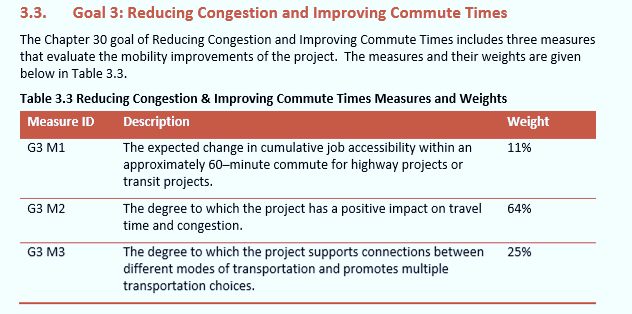
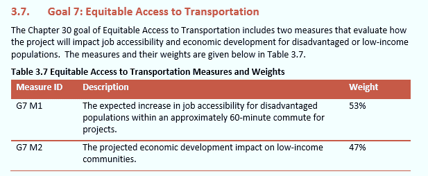

========================================
Chapter 30 Transit Accessibility Scoring
========================================

Pursuant to `Chapter 30 
<http://www.mdot.maryland.gov/newMDOT/Planning/Chapter_30_Score/Index.html>`_  
Acts of 2017 (`Senate Bill 307 <http://mgaleg.maryland.gov/2017RS/chapters_nol
n/Ch_30_sb0307E.pdf>`_) the Maryland Department of Transportation (MDOT) “shall, 
in accordance with federal transportation requirements, develop a project–based 
scoring system for major transportation projects using the goals and measures 
established under [Transportation Article 2-103.7(c)]. This process wil be used 
for all major projects being considered for inclusion in the Consolidated 
Transportation Program (CTP). ) An amendment to this law in 2017 defines a 
“major transportation project” as a highway or transit capacity project that exceeds 
$5,000,000, and excludes any “projects that are solely for system preservation.”

The Chapter 30 scoring model evaluates projects across nine goals and twenty-three 
measures that were established in statute, using a combination of project data, modeling 
analysis, and qualitative questionnaires. A project application process has been established 
requiring counties and municipalities to submit detailed project information when requesting 
funding for major transportation projects to ensure the necessary project information and 
priorities are provided to conduct the scoring.

Among the goals and measures articulated for Chapter 30 projects are “reducing 
congestion and improving commute times” (goal #3) and “equitable access to 
transportation” (goal #7). For each of these goals, the State has defined 
access to jobs as a key measure for project scoring, as shown in the 
following excerpts from the `Chapter 30 Technical Guide <http://www.mdot.maryland.gov/newMDOT/Planning/Chapter_30_Score/Images_and_Documents/FY%202019%20Chapter%2030%20Technical%20Guide.pdf>`__.

Measures G3 M1 and G7 M1 both rely on assessing the change in access to jobs 
attributable to the project. This document focuses on the development of 
scores for these measures for transit capacity project applications.

**Multimodal Accessibility Analysis (MMA) in Maryland**

.. image:: ../images/Destinations.png 
	:scale: 45%
	:alt: A graphic depicting the connections between an origin 
		to numerous destinations.
	:align: left

The Maryland Department of Transportation (MDOT) has for the past several years investigated 
emerging methods for estimating multimodal accessibility and applications of cumulative 
accessibility analyses for transportation planning. These efforts have yielded a planning 
framework referred to as the Multimodal Accessibility (MMA) framework. MMA relies on 
transportation network analysis and land use data at a variety of scales to measure access 
to activities of interest (e.g., jobs, essential services, education/training) by multiple 
travel modes.

In concept, `MMA analysis <concept.html#mma-in-concept>`_ is simple. The goal is to measure 
travel times from origin zones to destination zones and summarize the activities accessible 
from each origin zone. The resulting measure describes how well connected each zone is to 
other zones, accounting for the distribution of activities across all zones and the travel 
times expected for different system users to reach various destinations. In short, the measure 
is sensitive to changes in land uses and transportation system performance. It provides insight
into travel behaviors such as mode choices and can reveal differences in experienced or expected 
accessibility for different population groups, such as low-income households and minorities.

.. note::
	**Assumed Knowledge**

	This portion of the guide, which reviews the step-by-step process for scoring Chapter 30 
	transit project appplications, assumes basic knowledge of the ArcMap interface and  
	the following concepts, tools, and data sources:
	
	- `Multimodal Accessibility: Key Terms and Concepts <KeyTermsAndConcepts.html>`_
	- `MMA Geoprocessing Toolbox <mma-toolbox-main.html>`_ 
	- `Add GTFS to a Network Dataset Toolbox <https://esri.github.io/public-transit-tools/AddGTFStoaNetworkDataset.html>`_
	- `GTFS Feed Specification <https://developers.google.com/transit/gtfs/reference/>`_	

.. toctree::
    :maxdepth: 3

    Recommended Working Directory Structure <working-dir>
    Chapter 30 Project Scoring Toolbox <Ch30ToolboxOverview>
	Chapter 30 Transit Project Scoring Workflow <Ch30WorkflowOverview>
	Chapter 30 Transit Project Standard Report <ch30-transit-report>
